# MapleCFO: an AI personal-finance agent for Canadians

**EECS3311 Software Design, Fall 2026: Course Project, Stage 1 (Design Report)**

| | |
|---|---|
| **Author** | Krishna Patel |
| **Project** | MapleCFO, an AI "Chief Financial Officer" agent |
| **Language / platform** | Java 21 · JavaFX (GUI) · picocli (CLI) · SQLite · JUnit 5 |
| **AI model(s)** | Anthropic Claude (Messages API with tool use); a scripted `MockLlmClient` for offline demos and tests |
| **Stage** | 1: Design (before implementation) |

---

## Table of contents

1. [Project overview](#1-project-overview)
2. [Detailed feature specifications](#2-detailed-feature-specifications)
3. [UML class diagram](#3-uml-class-diagram)
4. [Design pattern explanations](#4-design-pattern-explanations)
5. [Use-case diagram](#5-use-case-diagram)
6. [Detailed use-case descriptions](#6-detailed-use-case-descriptions)
7. [Sequence diagrams](#7-sequence-diagrams)
8. [Feature-to-design traceability table](#8-feature-to-design-traceability-table)
9. [Feature implementation explanations](#9-feature-implementation-explanations)
10. [Important design decisions](#10-important-design-decisions)

---

## 1. Project overview

### 1.1 Problem and motivation

Canadian students and young professionals manage their money across several banks, credit cards and **registered accounts (TFSA, RRSP, FHSA)**. Every account has its own app, and the questions that actually matter cut across all of them:

- *"Can I afford a $2,000 trip in December without falling behind on my laptop fund?"*
- *"Should my next $500 go into my TFSA or toward my credit card?"*
- *"How much TFSA room do I actually have? I don't want an over-contribution penalty."*
- *"When could I retire if I saved 25% instead of 15%?"*

Banking apps only show one institution. Spreadsheets need manual formulas. Generic chatbots **invent numbers** because they cannot see the user's data. No tool combines the user's real data, reliable Canadian calculations and plain-language explanations.

### 1.2 Target users

| User group | Typical needs |
|---|---|
| University and college students | Budgeting on a small income, subscriptions, first credit card, first TFSA |
| Young professionals (22–35) | Net worth, TFSA/RRSP/FHSA room, saving for a first home, debt payoff, FIRE planning |
| Newcomers to Canadian personal finance | Understanding how registered accounts, budgeting and debt payoff work |

### 1.3 What the agent does

MapleCFO is a desktop application with a **GUI and a CLI** that imports the user's bank and card CSV exports, organises them, and runs a set of deterministic financial calculators. On top of this sits the **AI CFO agent**. It:

1. **Interprets** a free-form money question.
2. **Plans** which information it needs (spending, contribution room, goals, cash-flow forecast…).
3. **Uses tools**: it calls deterministic finance tools (10 of them) through a tool registry, one or more times.
4. **Reasons** over the tool results and explains the trade-offs in plain language, quoting only numbers the tools returned.
5. **Remembers** the conversation, so follow-ups like "what if I wait until January?" work.
6. **Proposes actions** (e.g. "create a savings goal") that the user must **confirm** before anything changes.

Around the agent, **automation features** keep the data fresh with almost no effort: CSVs saved to a watch folder import themselves, balances update from the CSVs, registered-account contributions are detected for one-click confirmation, and the official contribution limits update themselves from a validated file kept current by a weekly bot.

### 1.4 Why an AI agent is appropriate

- **The questions are open-ended and multi-step.** "Can I afford X?" needs a cash-flow forecast, the committed savings goals and budget status. A fixed form cannot anticipate every combination; an agent that plans and calls tools can.
- **Messy data needs judgement.** Merchant strings like `SQ *DOLLARAMA #1234 TORONTO` are hard to categorise with rules alone. The LLM handles the long tail.
- **People need explanations, not just numbers.** The LLM turns calculator output into an explanation a non-expert can act on.
- **The design keeps the AI honest.** Every number comes from deterministic, unit-tested code. The LLM never does arithmetic, and a `ResponseValidator` checks that the dollar amounts in its answer appear in the tool results.

### 1.5 AI / LLM model(s)

| Role | Model | Where used |
|---|---|---|
| Primary reasoning and tool-use model | **Anthropic Claude** (Sonnet-class model through the Messages API with tool use; exact version fixed at implementation time and recorded in Stage 2) | `CfoAgent`, `LlmCategorizer`, `ReportSummarizer` |
| Offline / test double | `MockLlmClient` (scripted, deterministic responses) | Unit and integration tests; demo mode when no API key is configured |

Both sit behind the **`LlmClient` interface** (Adapter pattern), so the rest of the system does not know which one is in use, and another provider could be added later without changing the agent.

### 1.6 How the AI interacts with the rest of the system

- The LLM **never touches the database or the file system directly.** It can only request one of the registered `FinanceTool`s by name, with JSON arguments.
- `ToolRegistry` **validates the arguments** against the tool's schema, runs the tool (which calls a deterministic service), and returns a structured `ToolResult` (or an error) to the agent.
- Tools that would **change data** (create a goal, set a budget) only create a *pending* `UndoableCommand`. It is executed only when the user clicks **Confirm**, and it can then be undone.
- The LLM is also used in two narrow, bounded places. It categorises transactions that no rule matched (and only answers that are valid category names are accepted), and it writes the narrative part of the monthly report, using figures that were already computed.

### 1.7 Overall architecture

The system is organised in layers. The GUI and CLI are thin presentation layers that talk **only** to `MapleCfoFacade`. The facade coordinates the deterministic domain services, the undo/redo command history and the AI agent. Infrastructure (SQLite repositories, the CSV import adapter, the event bus and the LLM adapter) sits at the bottom.

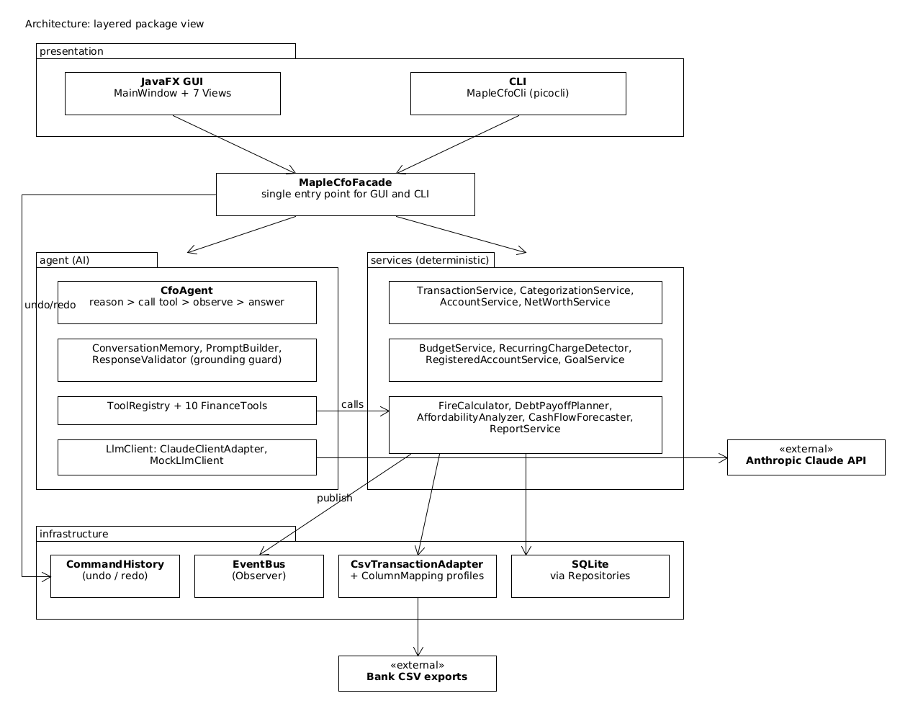

UMLet source: [diagrams/uxf/architecture.uxf](diagrams/uxf/architecture.uxf)

| Layer | Responsibility | Main classes |
|---|---|---|
| Presentation | Show data, collect input (GUI and CLI) | `MainWindow`, 7 `View`s, `MapleCfoCli`, `CliRenderer` |
| Application | Single entry point, undo/redo, event distribution | `MapleCfoFacade`, `CommandHistory`, `EventBus` |
| Agent (AI) | Plan, call tools, remember, validate answers | `CfoAgent`, `ToolRegistry`, `FinanceTool`s, `ConversationMemory`, `PromptBuilder`, `ResponseValidator`, `LlmClient` |
| Domain services (deterministic) | All financial logic and calculations | `TransactionService`, `BudgetService`, `RegisteredAccountService`, `FireCalculator`, `DebtPayoffPlanner`, … |
| Automation (deterministic) | Keep data current with minimal user effort | `ImportFolderWatcher`, `BalanceSyncService`, `ContributionDetector`, `ReminderService`, `RrspRoomEstimator`, `LimitsService` |
| Infrastructure | Persistence, import, external APIs | `Repository<T,ID>` + SQLite implementations, `CsvTransactionAdapter`, `ClaudeClientAdapter`, `RemoteLimitsProvider` |
| Off-app job | Keep the published limits file correct | `LimitsUpdateJob`, `CraLimitsScraper`, `LimitsValidator`, `GitHubIssueNotifier`, `EmailNotifier` (run weekly by GitHub Actions) |

---

## 2. Detailed feature specifications

MapleCFO has **15 major features**. F01–F12 are the core money features. F13–F15 are **automation features**: they keep the data up to date so that, after a one-time setup, the user only has to download bank CSVs. Login, settings and "about" screens are not counted. Each feature is classified as **Deterministic** (no AI), **AI** (driven by the LLM) or **Hybrid** (deterministic core, AI for one bounded step).

| ID | Feature | Type |
|---|---|---|
| F01 | Bank/card CSV import with column-mapping profiles | Deterministic |
| F02 | Smart transaction categorization with correction and undo | Hybrid |
| F03 | Accounts and net-worth dashboard | Deterministic |
| F04 | Monthly budgets and overspending alerts | Deterministic |
| F05 | Recurring charge and subscription detection | Deterministic |
| F06 | TFSA / RRSP / FHSA contribution-room tracker | Deterministic |
| F07 | FIRE (financial independence) projection | Deterministic |
| F08 | Debt payoff planner (avalanche vs snowball) | Deterministic |
| F09 | Savings goals with forecasts | Deterministic |
| F10 | AI CFO chat (multi-step, tool-using agent with memory) | AI |
| F11 | "Can I afford it?" affordability check | Hybrid |
| F12 | Monthly summary with AI narrative | Hybrid |
| F13 | Auto-sync: watch-folder import, automatic balances and reminders | Deterministic |
| F14 | Smart contributions: detection with confirmation, plus RRSP room estimate | Deterministic |
| F15 | Self-updating contribution limits, with a weekly checker bot and failure alerts | Deterministic |

### F01: Bank/card CSV import with column-mapping profiles

| Field | Specification |
|---|---|
| **Description** | Imports transactions from any bank or card CSV export through **one generic importer**. The first time, the user maps the file's columns (date, description, amount or debit/credit) and saves the mapping as a named **profile** (e.g. "TD chequing"). Later imports reuse the profile. Invalid rows are rejected with reasons, and duplicates from overlapping exports are skipped. |
| **User interaction (GUI)** | *Transactions* tab → **Import CSV** → file chooser, account selector, profile drop-down → column-mapping dialog when needed → import summary dialog. CLI: `maplecfo import <file> --account <id> --profile "TD chequing"`. |
| **Input** | CSV file path; target account; mapping profile name (or a new mapping). |
| **Output** | `ImportResult` (number imported, duplicates skipped, rejected rows with reasons, number left uncategorized) and the new rows in the transaction table. |
| **AI involvement** | Deterministic (categorization afterwards is F02). |
| **Expected workflow** | Load the profile → check that it fits the file's header → `CsvTransactionAdapter` reads, parses and validates rows (date, amount, description) → deduplicate using a fingerprint (date + amount + normalised description + account) → categorize (F02) → save → publish `TRANSACTIONS_IMPORTED`. |
| **Error / alternative cases** | No profile, or the profile does not match the header → the mapping dialog opens and the new mapping can be saved. Unreadable or empty file → error message, nothing saved. Some bad rows → valid rows are imported and bad rows are listed. File already imported → every row is reported as a duplicate. |

### F02: Smart transaction categorization with correction and undo

| Field | Specification |
|---|---|
| **Description** | Assigns every transaction a category (Groceries, Dining, Rent, …). Rules run first (merchant keywords and rules learned from the user's past corrections). Only transactions no rule matches are sent to the LLM, which must answer with one of the allowed category names. The user can correct any category, the system **learns** a rule from the correction, and every correction can be **undone or redone**. |
| **User interaction (GUI)** | Category drop-down in each row of the *Transactions* table; **Undo/Redo** buttons (Ctrl+Z / Ctrl+Y); filter "Needs review". CLI: `maplecfo tx recategorize <id> <CATEGORY>`, `maplecfo undo`. |
| **Input** | Transactions (from F01), or a transaction id plus a new category. |
| **Output** | Categorized transactions with their source (RULE / AI / USER); updated budgets and dashboard. |
| **AI involvement** | **Hybrid**: rules first, LLM only as a fallback. |
| **Expected workflow** | `CategorizationService` tries the strategies in order: `RuleBasedCategorizer`, then `LlmCategorizer`. An AI answer is accepted only if it is exactly one of the `Category` names. Anything else leaves the transaction UNCATEGORIZED ("needs review"). A user correction runs as a `RecategorizeCommand` through `CommandHistory` and adds a merchant rule. |
| **Error / alternative cases** | LLM unavailable or times out → rule-only mode, the rest marked for review. LLM returns an unknown category or extra text → rejected. Transaction deleted before undo → undo reports failure and the stacks stay consistent. |

### F03: Accounts and net-worth dashboard

| Field | Specification |
|---|---|
| **Description** | The user registers accounts (chequing, savings, credit cards, TFSA, RRSP, FHSA, loans) and keeps their balances up to date. The dashboard shows total assets, total liabilities and net worth, grouped (Banking, Registered, Investments, Debts), plus a net-worth history chart. |
| **User interaction (GUI)** | *Dashboard* tab: net-worth card, breakdown chart, **Add account**, and inline balance editing. CLI: `maplecfo accounts add …`, `maplecfo networth`. |
| **Input** | Account name, type, institution, balance. |
| **Output** | `NetWorthSnapshot` (total, assets, liabilities, subtotal per group) and charts. |
| **AI involvement** | Deterministic. |
| **Expected workflow** | Accounts are arranged as a **Composite** tree (`AccountGroup` → `Account`). `NetWorthService` asks the root for `getValue()`, which adds up its children recursively. Liabilities count as negative. A snapshot is stored each time balances change, for the history chart. |
| **Error / alternative cases** | Negative balance on an asset account → validation error. No accounts yet → empty state with an "Add your first account" prompt. Duplicate account name → warning. |

### F04: Monthly budgets and overspending alerts

| Field | Specification |
|---|---|
| **Description** | The user sets a monthly limit per category. The system tracks spending against each limit and raises an alert when a category reaches 80% and 100% of its limit. |
| **User interaction (GUI)** | *Budget* tab: list of categories with progress bars, **Set limit** field, alert banner. CLI: `maplecfo budget set DINING 250`, `maplecfo budget status`. |
| **Input** | Category, monthly limit, month. |
| **Output** | `List<BudgetStatus>` (spent, remaining, % used, exceeded?) and `BUDGET_EXCEEDED` alerts. |
| **AI involvement** | Deterministic. |
| **Expected workflow** | Setting a budget runs a `SetBudgetCommand` (undoable). `BudgetService` subscribes to the `TRANSACTIONS_IMPORTED` and `TRANSACTION_RECATEGORIZED` events. After each event it recomputes the status and publishes `BUDGET_EXCEEDED`, which the GUI views and `AlertService` receive. |
| **Error / alternative cases** | Limit ≤ 0 or non-numeric → validation error. A budget already exists for that category and month → replaced (and the old one is restored on undo). No transactions yet → 0% used. |

### F05: Recurring charge and subscription detection

| Field | Specification |
|---|---|
| **Description** | Finds charges that repeat at a regular interval (streaming, phone, gym, rent), estimates their yearly cost, predicts the next charge date, and flags **price increases**. |
| **User interaction (GUI)** | *Dashboard → Subscriptions* panel with a yearly total and "price increased" badges. CLI: `maplecfo recurring`. |
| **Input** | Transactions from the last 6 months. |
| **Output** | `List<RecurringCharge>` (merchant, average amount, frequency, next expected date, priceIncreased). |
| **AI involvement** | Deterministic. |
| **Expected workflow** | Normalise merchant names → group by merchant → keep groups with at least 3 charges at a roughly regular interval (weekly, monthly or yearly, ±3 days) → compute the average → flag if the latest charge is more than 5% above the average. |
| **Error / alternative cases** | Less than 3 months of data → results shown with a "low confidence" note. Irregular amounts (such as a utility bill) → shown with a "variable amount" label. |

### F06: TFSA / RRSP / FHSA contribution-room tracker

| Field | Specification |
|---|---|
| **Description** | Computes the user's available contribution room for each registered account and **warns before an over-contribution** (which is taxed by CRA). Annual limits come from `contribution_limits.json`, which updates itself (F15), so neither code changes nor user input are needed each year. |
| **User interaction (GUI)** | *Planning → Registered accounts*: room gauge per account, contribution/withdrawal log, **Check contribution** box. CLI: `maplecfo room TFSA`, `maplecfo room check TFSA 3000`. |
| **Input** | `UserProfile` (birth year, year of Canadian residency, RRSP deduction limit from the CRA Notice of Assessment, FHSA opening year); logged contributions and withdrawals; proposed amount. |
| **Output** | `ContributionRoom` (limit, used, available) and `ContributionCheck` (OK / OVER with the excess / UNKNOWN with the missing fields). |
| **AI involvement** | Deterministic. |
| **Expected workflow** | **TFSA:** room = sum of annual limits from the first eligible year (the latest of 2009, the year the user turned 18, and the year they became resident), plus withdrawals made in previous years, minus contributions. **FHSA:** annual limit plus carry-forward (capped), lifetime limit. **RRSP:** the deduction limit entered by the user minus contributions. If the amount exceeds the room → `CONTRIBUTION_WARNING` event. |
| **Error / alternative cases** | Profile incomplete → UNKNOWN, with the missing fields listed. Remote limits unavailable or invalid → the cached, then bundled, limits are used (F15). Negative amount → validation error. |

### F07: FIRE (financial independence) projection

| Field | Specification |
|---|---|
| **Description** | Projects when the user could reach financial independence: the year their invested assets reach annual spending divided by the chosen withdrawal rate. It compares scenarios at different savings rates. |
| **User interaction (GUI)** | *Planning → FIRE* form (current investments, yearly spending, yearly savings, expected real return, withdrawal rate) with a growth chart and a scenario table. CLI: `maplecfo fire --spend 40000 --save 15000 --return 0.05`. |
| **Input** | `FireInputs` (invested amount, yearly saving, annual spending, real return, withdrawal rate, current age). |
| **Output** | `FireProjection` (target amount, years and age at FIRE, balance for each year, scenarios). |
| **AI involvement** | Deterministic. |
| **Expected workflow** | target = spending ÷ withdrawal rate. Simulate year by year: balance = balance × (1 + r) + saving, until balance ≥ target (at most 70 years). Repeat for ±5% savings-rate scenarios. |
| **Error / alternative cases** | Negative values, return rate outside −5%…15%, or withdrawal rate outside 2%…6% → validation errors. Target never reached within 70 years → "not reachable with these inputs" plus a suggestion. |

### F08: Debt payoff planner (avalanche vs snowball)

| Field | Specification |
|---|---|
| **Description** | Builds a month-by-month payoff schedule for the user's debts (cards, student loan, car loan) using the **avalanche** method (highest APR first) or the **snowball** method (smallest balance first), and compares total interest and time to become debt-free. |
| **User interaction (GUI)** | *Planning → Debt*: list of debts, method toggle, extra monthly payment, timeline chart, comparison table. CLI: `maplecfo debt plan --method avalanche --extra 200`. |
| **Input** | Debts (balance, APR, minimum payment); method; extra monthly amount. |
| **Output** | `PayoffPlan` (months to debt-free, total interest, schedule, payoff date per debt). |
| **AI involvement** | Deterministic. |
| **Expected workflow** | `DebtPayoffPlanner` asks its `PayoffStrategy` for the order, then simulates each month: add interest, pay the minimums, put the extra on the first debt in the order, and when a debt is paid off, roll its payment into the next one. |
| **Error / alternative cases** | No debts → "debt-free" message. Minimum payment lower than the monthly interest (the balance never shrinks) → warning for that debt. APR outside 0–60% → validation error. |

### F09: Savings goals with forecasts

| Field | Specification |
|---|---|
| **Description** | The user creates goals (emergency fund, laptop, down payment) with a target amount and deadline. The system tracks progress and forecasts whether the goal will be met, using the cash-flow forecast. |
| **User interaction (GUI)** | *Goals* tab: goal cards with progress rings, **New goal**, **Add deposit**. CLI: `maplecfo goal add "Laptop" 1800 2027-04-30`, `maplecfo goal list`. |
| **Input** | Name, target, deadline, optional linked account; deposits. |
| **Output** | `GoalForecast` (required monthly saving, projected completion date, on-track flag). |
| **AI involvement** | Deterministic (the agent can *propose* a goal, which the user must confirm; see F10 and F11). |
| **Expected workflow** | Creation runs as a `CreateGoalCommand` (undoable). Forecast: required per month = (target − saved) ÷ months left, compared with the average monthly surplus from `CashFlowForecaster`. |
| **Error / alternative cases** | Target ≤ 0 or deadline in the past → validation error. Surplus is negative → "not on track" with the shortfall. Goal reached → `GOAL_UPDATED` event and a congratulation banner. |

### F10: AI CFO chat (multi-step, tool-using agent with memory)

| Field | Specification |
|---|---|
| **Description** | A conversational agent that answers free-form money questions by **planning and calling finance tools** (net worth, spending summary, budget status, contribution room, FIRE, debt plan, goals, recurring charges, affordability, propose action). It keeps conversation memory for follow-ups, quotes only tool-provided numbers, and can **propose** changes that the user must confirm. |
| **User interaction (GUI)** | *Chat* tab: message box, answer bubbles with "tools used" chips, **Confirm / Dismiss** buttons for proposed actions. CLI: `maplecfo ask "…"`, or an interactive `maplecfo chat` session. |
| **Input** | Natural-language message; conversation history; the user's financial data (only through tools). |
| **Output** | `AgentResponse` (answer, tools used, grounded flag, optional pending action id). |
| **AI involvement** | **AI.** |
| **Expected workflow** | Save the message in memory → build the prompt (system rules, a short profile summary, recent turns) → loop of at most 6 steps: call the LLM with the tool schemas → if it asks for tools, validate and run them and add the results to the conversation → if it gives a final answer, `ResponseValidator` checks every dollar amount against the tool results (if some are ungrounded, ask for one revision) and appends an educational disclaimer. |
| **Error / alternative cases** | LLM API error → one retry with backoff, then a "AI unavailable" message pointing to the manual tabs. Unknown tool or invalid arguments → error result sent back to the LLM, which must recover. Step limit reached → partial answer. Question out of scope (e.g. "which stock should I buy?") → polite refusal with education only. Ambiguous question → the agent asks one clarifying question. |

### F11: "Can I afford it?" affordability check

| Field | Specification |
|---|---|
| **Description** | Given an amount and a date, decides whether a purchase is **affordable, affordable with trade-offs, or not affordable**. It takes the projected balance, committed savings goals, budget status and a safety buffer into account. Available as a form and as an agent tool. |
| **User interaction (GUI)** | *Goals → Can I afford it?* form, or ask in *Chat*. CLI: `maplecfo afford 2000 --on 2026-12-20`. |
| **Input** | Amount, target date. |
| **Output** | `AffordabilityResult` (verdict, headroom, shortfall, affected goals). In chat, an explanation plus an optional goal proposal. |
| **AI involvement** | **Hybrid**: the verdict is computed deterministically. The agent explains it and may propose a goal. |
| **Expected workflow** | `CashFlowForecaster` projects the balance up to the date (average income minus spending plus known recurring charges) → subtract the monthly contributions to committed goals and a safety buffer (1 month of fixed costs) → classify the result. |
| **Error / alternative cases** | Date in the past → validation error. Less than 2 months of history → "insufficient data" with low confidence. Amount ≤ 0 → validation error. |

### F12: Monthly summary with AI narrative

| Field | Specification |
|---|---|
| **Description** | Produces a monthly summary (income, spending per category, budget results, net-worth change, subscriptions, goal progress) with a short **AI-written narrative** based only on the computed figures. It is shown on screen in the GUI and printed as formatted text in the CLI. |
| **User interaction (GUI)** | *Reports* tab: month picker, **Generate**, summary screen with charts. CLI: `maplecfo report 2026-09`. |
| **Input** | Month. |
| **Output** | `MonthlyReport` (figures + narrative) displayed in the GUI or CLI. |
| **AI involvement** | **Hybrid**: the figures are deterministic, the narrative is written by the LLM. |
| **Expected workflow** | `ReportService` gathers the figures from the services → `ReportSummarizer` sends *only the computed figures* to the LLM to write the narrative → the summary is displayed. |
| **Error / alternative cases** | No data for the month → message. LLM unavailable → template-based narrative (no AI). |

### F13: Auto-sync (watch-folder import, automatic balances, reminders)

| Field | Specification |
|---|---|
| **Description** | The user picks a **watch folder** (e.g. `~/Downloads/MapleCFO Inbox`). Any CSV saved there is imported automatically with the matching mapping profile. After each import, **account balances** are updated from the CSV's Balance column and **credit-card debt balances** are updated too, so net worth and the debt planner stay current. **Reminders** appear when an account hasn't been imported for 30 days and when a new monthly summary is ready. |
| **User interaction (GUI)** | *Settings → Auto-sync*: choose the folder and turn it on or off; reminder banners on the Dashboard. CLI: `maplecfo sync start <folder>`, `maplecfo sync stop`, `maplecfo reminders`. |
| **Input** | Watch-folder path; CSV files saved into it; saved mapping profiles. |
| **Output** | Imported transactions, updated account and debt balances, `ACCOUNT_BALANCE_UPDATED` events, reminder alerts. |
| **AI involvement** | Deterministic (the import itself reuses F01/F02). |
| **Expected workflow** | `ImportFolderWatcher` (Java `WatchService`) sees a new file → chooses the mapping profile whose columns match the header → calls `importTransactions()` → `TransactionService` publishes `TRANSACTIONS_IMPORTED` → `BalanceSyncService` reads the last balance and updates the account/debt → views refresh. `ReminderService` checks the last-import dates daily and at start-up. |
| **Error / alternative cases** | No profile matches the file → the user is asked to map the columns (as in F01). File still being written → wait until its size is stable before importing. Same file dropped twice → duplicates are skipped by fingerprint. No Balance column → balances are left unchanged and the user is told. Folder deleted or unavailable → auto-sync pauses with a warning. |

### F14: Smart contributions (detection with confirmation, RRSP room estimate)

| Field | Specification |
|---|---|
| **Description** | After each import, MapleCFO looks for transfers into registered accounts (e.g. `TFSA CONTRIBUTION`, a transfer to the linked TFSA account) and **proposes** them as contribution records. The user confirms or dismisses each one, and confirmed ones are undoable. It also **estimates new RRSP room** from last year's payroll deposits (18% of earned income, up to the yearly maximum), which the user confirms or replaces with the figure from their CRA Notice of Assessment. |
| **User interaction (GUI)** | "Log $500 TFSA contribution?" banner with **Confirm / Dismiss**; *Planning → Registered accounts → RRSP estimate* card. CLI: `maplecfo contributions pending`, `maplecfo rrsp estimate 2026`. |
| **Input** | Newly imported transactions; detection rules; payroll (INCOME) transactions from the previous year; RRSP rate and maximum from the limits file. |
| **Output** | Pending `RecordContributionCommand`s, confirmed `ContributionRecord`s, `RrspEstimate` (amount, basis, confidence). |
| **AI involvement** | Deterministic (rule-based detection; the user always confirms). |
| **Expected workflow** | `ContributionDetector` listens for `TRANSACTIONS_IMPORTED` → matches rules → stores a `RecordContributionCommand` in `PendingActionStore` and publishes `CONTRIBUTION_DETECTED` → on Confirm, the facade runs it through `CommandHistory`. `RrspRoomEstimator` sums last year's income deposits and applies min(18% × income, yearly max). |
| **Error / alternative cases** | Ambiguous transfer (e.g. to "SAVINGS") → not proposed. Dismissed proposal → not proposed again for that transaction. No payroll deposits found → estimate is UNKNOWN and the user enters the NOA figure. Income includes non-employment money → the estimate is labelled "estimate" and must be confirmed. |

### F15: Self-updating contribution limits (with weekly checker bot and failure alerts)

| Field | Specification |
|---|---|
| **Description** | The yearly TFSA/FHSA/RRSP limits are never typed by the end user. At start-up (at most once a week) the app downloads `contribution_limits.json` from the project's GitHub repository, **validates** it, and caches it; if anything fails it falls back to the last good copy, then to the copy bundled with the app. The file itself is kept current by a **weekly GitHub Actions bot** that reads CRA's official pages, validates the numbers with the same rules, and commits only if they pass. If scraping or validation fails, the bot changes nothing, opens a GitHub issue and **emails the developer**. |
| **User interaction (GUI)** | None needed. *Settings → About data* shows "Limits last updated: <date> (source)". CLI: `maplecfo limits status`, `maplecfo limits refresh`. |
| **Input** | Remote JSON file; cached copy; bundled copy. Bot: CRA web pages and the current JSON in the repo. |
| **Output** | Current `ContributionLimits`, `LimitsStatus` (UP_TO_DATE / UPDATED / USING_CACHED), `LIMITS_UPDATED` event. Bot: a commit, or a GitHub issue plus an email. |
| **AI involvement** | Deterministic. |
| **Expected workflow** | App: `LimitsService.refreshIfStale()` → `RemoteLimitsProvider.load()` → `LimitsValidator.validate(next, previous)` → save to `LimitsCache` → publish `LIMITS_UPDATED`. Bot: `LimitsUpdateJob.run()` → `CraLimitsScraper.fetch()` → `LimitsValidator` → commit if valid, otherwise `GitHubIssueNotifier` + `EmailNotifier`. |
| **Error / alternative cases** | No internet → use cached limits. Downloaded file fails validation (past years changed, TFSA limit not a multiple of $500, a jump of more than $1,000, broken structure) → rejected, previous values kept. No cache on first run and no internet → bundled limits. CRA page layout changed → bot fails safely and alerts the developer. |

---

## 3. UML class diagram

All diagrams are drawn in **UMLet**, and the editable `.uxf` file for each one is in `docs/stage1/diagrams/uxf/`. The complete class diagram is too large to read as a single picture, so it is presented in **seven parts, one per package**. Classes that appear in more than one part (for example `BudgetService`, `LlmClient`) are the same class. Each part only repeats the members relevant to that part. The architecture diagram in 1.7 shows how the packages depend on each other.

**Notation:** `+` public, `-` private, `#` protected, *italic / `*`* abstract, underlined / `$` static. Solid arrow = association, dashed arrow = dependency, hollow triangle = inheritance/realisation, filled diamond = composition, hollow diamond = aggregation. Multiplicities are shown where they carry meaning.

### 3.1 Part 1: Domain model

Plain domain objects plus the **Composite** structure used for net worth. Every class is connected: an `Account` holds `Transaction`s, a `SavingsGoal` is funded from an account, a `Debt` tracks the balance of a credit-card or loan account, and a `RecurringCharge` is detected from repeated transactions. `Money` is an immutable value object (BigDecimal) so that no floating-point rounding errors reach financial totals.

**Class diagram (1/7): Domain model (Composite: net worth)**

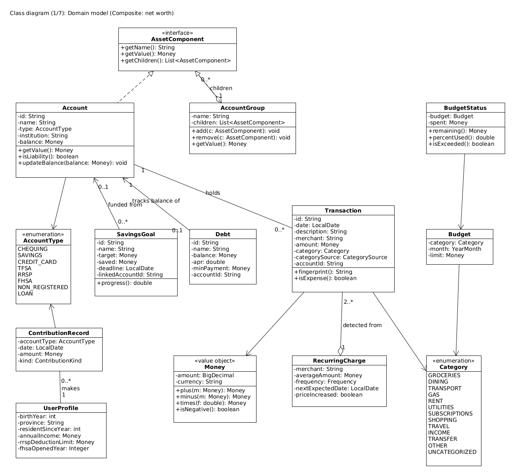

UMLet source: [diagrams/uxf/class_domain.uxf](diagrams/uxf/class_domain.uxf)

### 3.2 Part 2: Import and categorization

A single `CsvTransactionAdapter` **adapts** any bank's CSV layout to the `TransactionImporter` interface using a saved `ColumnMapping` profile, plus the **Strategy**-based categorization chain.

**Class diagram (2/7): Import and categorization (Adapter, Strategy)**

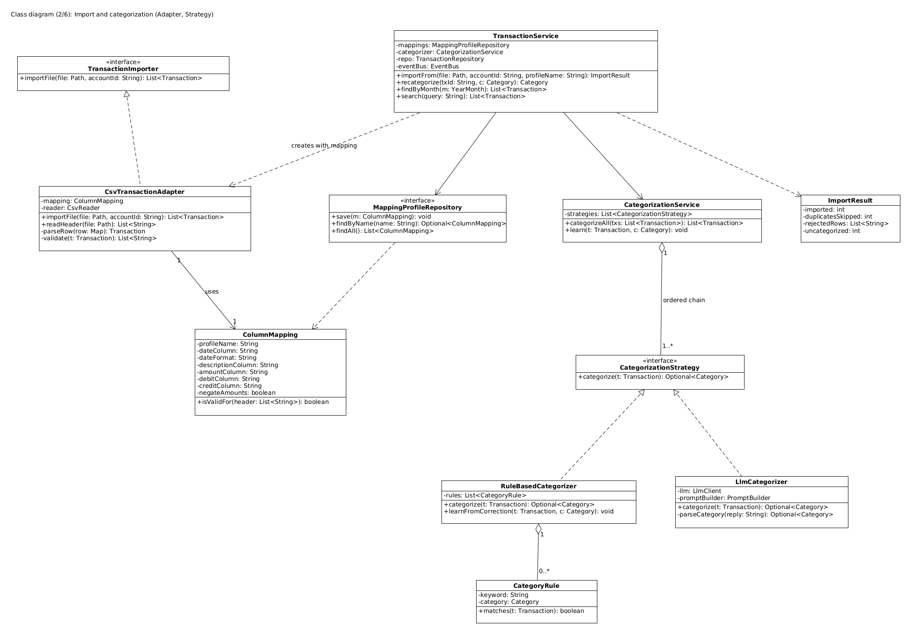

UMLet source: [diagrams/uxf/class_import.uxf](diagrams/uxf/class_import.uxf)

### 3.3 Part 3: Planning and analysis services

The deterministic "calculators". `DebtPayoffPlanner` uses a **Strategy** (`PayoffStrategy`). All of these classes are pure logic with injected repositories, which makes them easy to unit-test in Stage 3.

**Class diagram (3/7): Planning and analysis services (Strategy)**

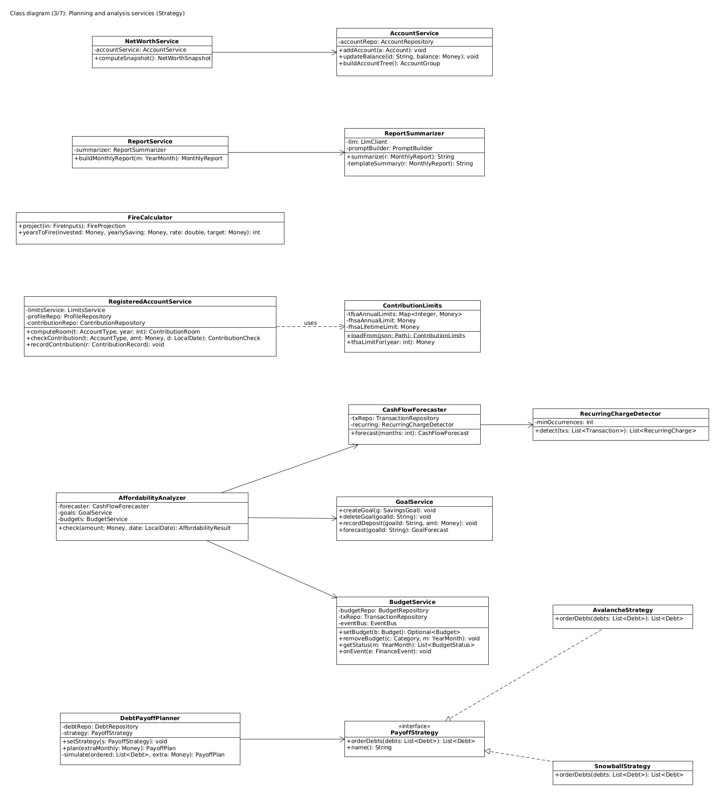

UMLet source: [diagrams/uxf/class_planning.uxf](diagrams/uxf/class_planning.uxf)

### 3.4 Part 4: Events and undoable commands

The **Observer** event bus that keeps views, budgets and alerts in sync, and the **Command** objects that make user edits and agent-proposed actions undoable.

**Class diagram (4/7): Events and undoable commands (Observer, Command)**

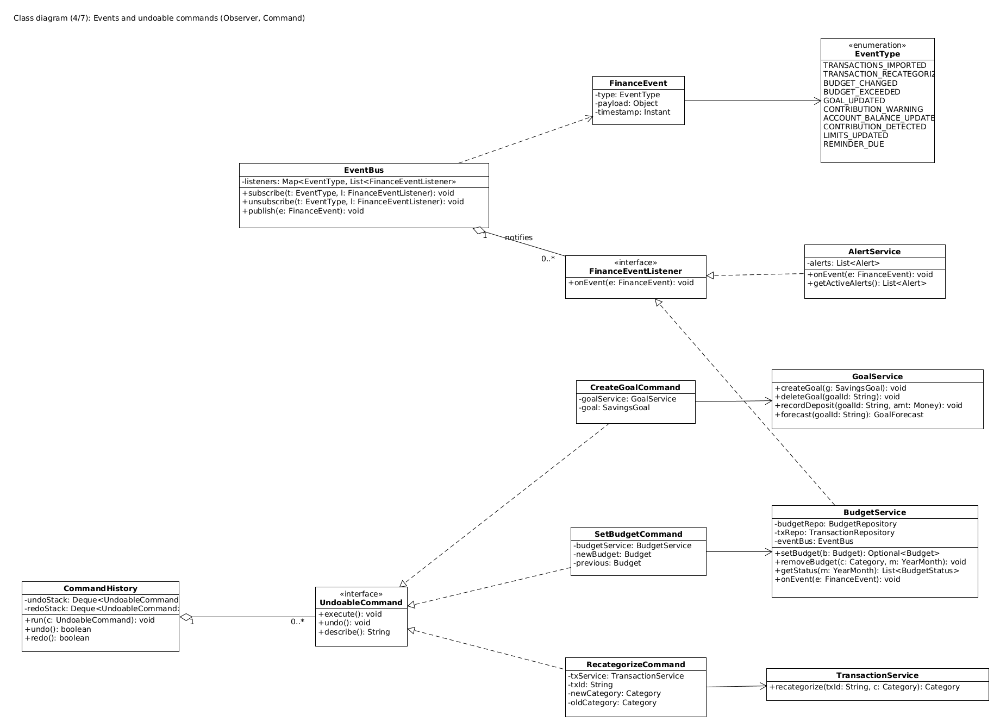

UMLet source: [diagrams/uxf/class_events.uxf](diagrams/uxf/class_events.uxf)

### 3.5 Part 5: Agent layer (AI components)

The AI agent and its collaborators. `LlmClient` is an **Adapter** over the different LLM vendor APIs, `LlmClientFactory` is a **Factory Method** (Claude or offline mock, depending on configuration), `AbstractFinanceTool` is a **Template Method**, and `ProposeActionTool` produces **Command** objects.

**Class diagram (5/7): Agent layer (Adapter, Factory Method, Template Method, Command)**

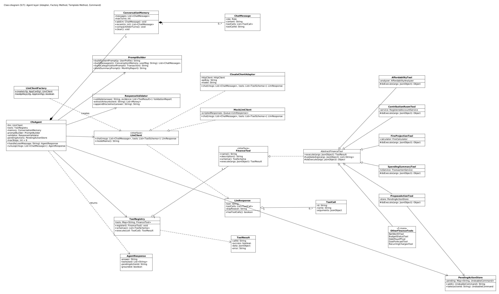

UMLet source: [diagrams/uxf/class_agent.uxf](diagrams/uxf/class_agent.uxf)

### 3.6 Part 6: Presentation, Facade and persistence

JavaFX views and the picocli CLI both depend only on the **Facade**. Persistence follows the **Repository/DAO** pattern over SQLite.

**Class diagram (6/7): Presentation, Facade and persistence (Facade, MVC, Repository/DAO)**

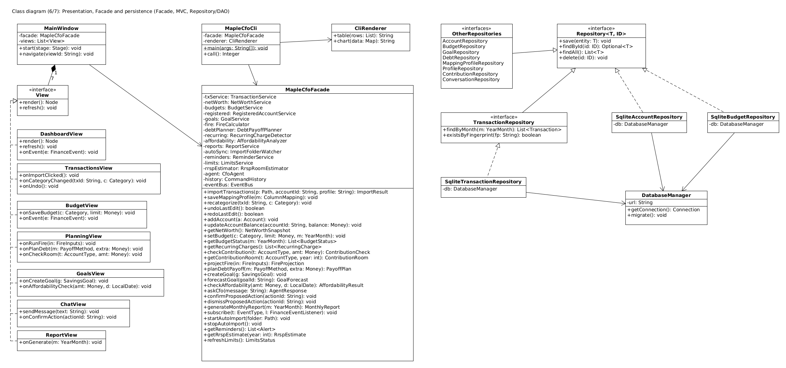

UMLet source: [diagrams/uxf/class_ui.uxf](diagrams/uxf/class_ui.uxf)

### 3.7 Part 7: Automation

The auto-sync, contribution-detection and self-updating-limits features. `LimitsService` tries an ordered list of **Strategy** providers (remote file → bundled copy) guarded by `LimitsValidator` and `LimitsCache`; `BalanceSyncService` and `ContributionDetector` are **Observers** of import events; detected contributions are **Command** objects the user confirms. `LimitsUpdateJob` is a separate entry point run weekly by GitHub Actions; it reuses `LimitsValidator` and reports failures through interchangeable `FailureNotifier`s.

**Class diagram (7/7): Automation (auto-sync, contribution detection, self-updating limits)**

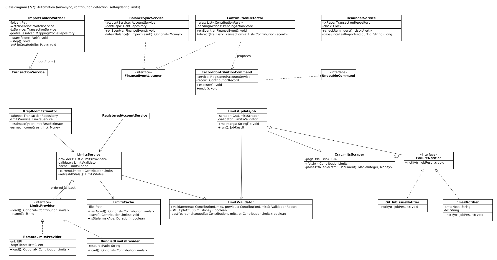

UMLet source: [diagrams/uxf/class_automation.uxf](diagrams/uxf/class_automation.uxf)

### 3.8 Key result / value classes (not drawn separately)

These are simple immutable data carriers (Java `record`s) returned by services. They are named in the diagrams and tables: `ImportResult`, `NetWorthSnapshot`, `ContributionRoom`, `ContributionCheck`, `FireInputs`, `FireProjection`, `PayoffPlan`, `GoalForecast`, `CashFlowForecast`, `AffordabilityResult`, `MonthlyReport`, `ValidationReport`, `ToolSchema`, `Alert`, `RrspEstimate`, `LimitsStatus`, `JobResult`, `ContributionRule`, plus the enums `PayoffMethod`, `CategorySource`, `Frequency`, `ContributionKind`, `Role`.

---

## 4. Design pattern explanations

MapleCFO uses **eight GoF patterns** (at least five are required), plus the MVC and Repository architectural patterns. Each one solves a specific problem in this application.

### 4.1 Facade: `MapleCfoFacade`

| | |
|---|---|
| **Problem** | Two user interfaces (GUI and CLI) need the same 20+ operations, which are spread across more than 12 services, the command history and the agent. Without a single entry point both UIs would depend on every subsystem and duplicate the coordination logic. |
| **Participants and roles** | *Facade*: `MapleCfoFacade`. *Subsystem classes*: `TransactionService`, `BudgetService`, `RegisteredAccountService`, `FireCalculator`, `DebtPayoffPlanner`, `GoalService`, `AffordabilityAnalyzer`, `ReportService`, `CfoAgent`, `CommandHistory`, `EventBus`, plus the automation services `ImportFolderWatcher`, `ReminderService`, `LimitsService`, `RrspRoomEstimator`. *Clients*: `MainWindow` and its views, `MapleCfoCli`. |
| **Why appropriate** | It gives low coupling between presentation and logic, one place to wrap operations in commands, and it guarantees that the GUI and the CLI behave identically. It is also the natural target for integration tests. |
| **Harder without it** | Every view and every CLI command would need references to many services and would have to remember to wrap edits in commands. Adding the CLI would mean duplicating orchestration code, and GUI and CLI behaviour would drift apart. |

### 4.2 Adapter: `CsvTransactionAdapter`, `ClaudeClientAdapter` and `CraLimitsScraper`

| | |
|---|---|
| **Problem** | (a) Every bank exports CSV with different column names, date formats and sign conventions, but the system needs uniform `Transaction` objects. (b) The Claude API has its own HTTP request format and tool-calling JSON, but the agent should work with simple Java objects (`ChatMessage`, `ToolCall`, `LlmResponse`). (c) CRA publishes the contribution limits as HTML web pages, but the limits job needs a `ContributionLimits` object. |
| **Participants and roles** | (a) *Target*: `TransactionImporter`. *Adapter*: `CsvTransactionAdapter`, configured by a `ColumnMapping`. *Adaptee*: the bank-specific CSV layout. *Client*: `TransactionService`. (b) *Target*: `LlmClient`. *Adapter*: `ClaudeClientAdapter` (plus `MockLlmClient`, a scripted implementation of the same interface). *Adaptee*: the Anthropic Messages API. *Client*: `CfoAgent`, `LlmCategorizer`, `ReportSummarizer`. (c) *Adapter*: `CraLimitsScraper` (`fetch()` returns `ContributionLimits`). *Adaptee*: CRA's HTML pages. *Client*: `LimitsUpdateJob`. |
| **Why appropriate** | One data-driven adapter supports any bank without new code: the user just saves a new mapping profile. The agent depends on the abstraction `LlmClient`, not on Claude's JSON format (Dependency Inversion), which makes a **mock LLM** possible for deterministic tests and offline demos. |
| **Harder without it** | CSV parsing would need a class per bank. `CfoAgent` would contain vendor-specific JSON handling, and it could not be unit-tested without network calls and API costs. |

### 4.3 Template Method: `AbstractFinanceTool.execute()`

| | |
|---|---|
| **Problem** | All 10 agent tools must follow the same safety steps: validate the LLM-supplied arguments, run the action, and wrap the outcome (or any exception) in a `ToolResult`. Only the core action differs from tool to tool. |
| **Participants and roles** | *Abstract class*: `AbstractFinanceTool`, with the template method `execute()` and the hooks `validateArgs()` and `doExecute()`. *Concrete classes*: `AffordabilityTool`, `ContributionRoomTool`, `FireProjectionTool`, `SpendingSummaryTool`, `ProposeActionTool`, `NetWorthTool`, `BudgetStatusTool`, `DebtPayoffTool`, `GoalForecastTool`, `RecurringChargesTool`. |
| **Why appropriate** | The invariant steps protect against bad LLM arguments. They are written and tested once and cannot be skipped by a subclass. |
| **Harder without it** | Each of the 10 tools would repeat the validation and error handling. One forgotten check would let the LLM run a tool with invalid arguments or crash the agent loop with an uncaught exception. |

### 4.4 Factory Method: `LlmClientFactory.create()`

| | |
|---|---|
| **Problem** | Which `LlmClient` to create depends on configuration: the real `ClaudeClientAdapter` when an API key and model name are configured, or `MockLlmClient` for tests and offline demo mode. Clients should not use `new ClaudeClientAdapter(...)` themselves or read configuration. |
| **Participants and roles** | *Creator*: `LlmClientFactory` with `create(AppConfig)`. *Product*: `LlmClient`. *Concrete products*: `ClaudeClientAdapter`, `MockLlmClient`. *Clients*: application start-up code, which injects the product into `CfoAgent`, `LlmCategorizer` and `ReportSummarizer`. |
| **Why appropriate** | Creation logic (reading the API key, model name and timeouts, and choosing demo mode) lives in one place, and the three AI components depend only on the product interface. |
| **Harder without it** | Configuration parsing and `if (apiKey == null)` checks would be copied into every AI component, and switching to demo mode or adding another provider would mean editing all of them. |

### 4.5 Strategy: categorization, debt payoff, limits sources and failure notifiers

| | |
|---|---|
| **Problem** | Several behaviours have interchangeable algorithms chosen at run time: *how to categorise* (rules or LLM), *which debt to pay first* (avalanche or snowball), *where to load contribution limits from* (remote file or bundled copy) and *how to report a failed limits update* (GitHub issue or email). |
| **Participants and roles** | *Contexts*: `CategorizationService`, `DebtPayoffPlanner`, `LimitsService`, `LimitsUpdateJob`. *Strategy interfaces*: `CategorizationStrategy`, `PayoffStrategy`, `LimitsProvider`, `FailureNotifier`. *Concrete strategies*: `RuleBasedCategorizer`, `LlmCategorizer`; `AvalancheStrategy`, `SnowballStrategy`; `RemoteLimitsProvider`, `BundledLimitsProvider`; `GitHubIssueNotifier`, `EmailNotifier`. |
| **Why appropriate** | The user switches payoff methods with a toggle and compares them. Categorization strategies and limits providers are both used as an ordered fallback chain (cheap or reliable first). Each strategy is small and testable on its own; for example `LimitsService` can be tested with a fake provider that simulates a network failure. |
| **Harder without it** | `DebtPayoffPlanner.plan()` would contain `if (method == AVALANCHE) … else …` branches inside the simulation loop. Adding a new method (for example "highest interest-to-balance ratio"), a new limits source or a new alert channel (for example Slack) would mean modifying tested code. |

### 4.6 Observer: `EventBus` and `FinanceEventListener`

| | |
|---|---|
| **Problem** | When transactions are imported or recategorised, many independent parts must react: budget status, alerts, balance syncing, contribution detection, the dashboard, the budget view. The code that imports transactions should not know about any of them. |
| **Participants and roles** | *Subject*: `EventBus` (`subscribe`, `unsubscribe`, `publish`). *Observer interface*: `FinanceEventListener`. *Concrete observers*: `BudgetService`, `AlertService`, `BalanceSyncService`, `ContributionDetector`, `DashboardView`, `BudgetView`. *Publishers*: `TransactionService`, `BudgetService`, `GoalService`, `RegisteredAccountService`, `LimitsService`, `ReminderService`. *Event*: `FinanceEvent` with `EventType`. |
| **Why appropriate** | It keeps the GUI up to date without polling and decouples the services from each other. The same events drive the CLI's alert output. |
| **Harder without it** | `TransactionService` would have to call `budgetService.recheck()`, `dashboard.refresh()` and so on directly, creating circular dependencies between the domain and the UI. Every new view would mean editing the services. |

### 4.7 Command: `UndoableCommand`, `CommandHistory` and `PendingActionStore`

| | |
|---|---|
| **Problem** | (a) Users need undo/redo for edits (recategorise, set budget, create goal). (b) The **agent, and the contribution detector, must never modify data by themselves**. Its proposed actions need to be stored as objects, shown to the user, and executed only after confirmation. |
| **Participants and roles** | *Command interface*: `UndoableCommand` (`execute`, `undo`, `describe`). *Concrete commands*: `RecategorizeCommand`, `SetBudgetCommand`, `CreateGoalCommand`, `RecordContributionCommand`. *Receivers*: `TransactionService`, `BudgetService`, `GoalService`, `RegisteredAccountService`. *Invoker*: `CommandHistory` (undo/redo stacks). *Client*: `MapleCfoFacade`; `ProposeActionTool` and `ContributionDetector` create commands and store them in `PendingActionStore` until the user confirms. |
| **Why appropriate** | Requests become objects, which gives undo/redo, a readable description for the Confirm dialog (`describe()`), and a **human-in-the-loop safety guarantee** for AI actions. |
| **Harder without it** | Each edit would need its own ad-hoc undo code, and there would be no clean way to represent "an action the AI suggested but the user has not approved yet". |

### 4.8 Composite: `AssetComponent`, `Account` and `AccountGroup`

| | |
|---|---|
| **Problem** | Net worth is a tree: groups (Banking, Registered, Debts) contain accounts, and groups can contain sub-groups (for example Registered → TFSA / RRSP / FHSA). Clients want to ask any node "what is your value?" in the same way. |
| **Participants and roles** | *Component*: `AssetComponent`. *Leaf*: `Account` (negative value if it is a liability). *Composite*: `AccountGroup` (adds up its children). *Client*: `NetWorthService`, the dashboard chart. |
| **Why appropriate** | The dashboard breakdown, the subtotals and the net-worth total all come from the same recursive `getValue()`, and new grouping levels need no code changes. |
| **Harder without it** | The dashboard and `NetWorthService` would need type checks and nested loops for each level, and subtotals would be computed in several places. |

### 4.9 Architectural patterns (in addition to the eight above)

- **MVC**: *Model* = domain objects and services. *View* = the JavaFX `View` classes (and `CliRenderer` for text). *Controller* = the views' event handlers delegating to `MapleCfoFacade`. Views never contain financial logic.
- **Repository / DAO**: `Repository<T,ID>` with SQLite implementations isolates SQL. Services can be tested with in-memory fakes.

---

## 5. Use-case diagram

**Actors**

| Actor | Type | Description |
|---|---|---|
| **User** | Primary | A student or young professional managing their money. Specialised into **GUI User** and **CLI User** (both reach the same use cases). |
| **LLM Service** | Secondary (external AI service) | The Anthropic Claude API, reached through `LlmClient`. Takes part in categorisation, the AI CFO chat and report summaries. |
| **Limits Bot** | Primary (scheduled system actor) | A GitHub Actions job that runs weekly to refresh the published contribution limits (UC15). |
| **Developer** | Secondary | The project maintainer, notified by GitHub issue and email when the limits update fails. |

The 15 main use cases cover all 15 features. `«include»` marks behaviour that always happens as part of a use case. `«extend»` marks optional behaviour (confirming an action the AI proposed).

**Use-case diagram: MapleCFO**

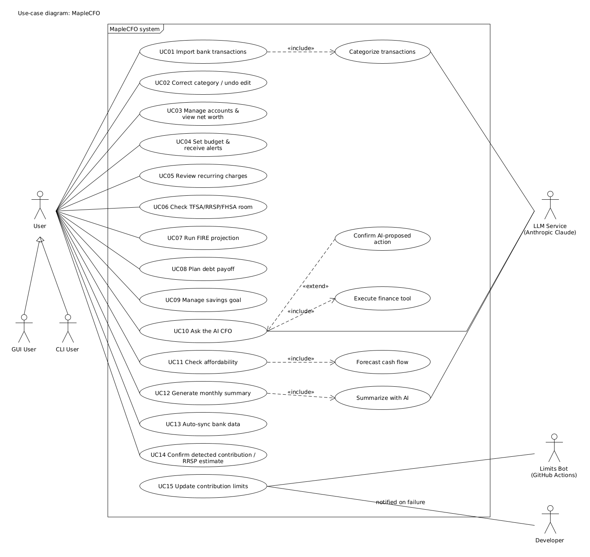

UMLet source: [diagrams/uxf/usecase.uxf](diagrams/uxf/usecase.uxf)

> *Notation:* stick-figure actors, use-case ovals inside the system boundary, and dashed «include»/«extend» arrows. All UML diagrams in this report are drawn in **UMLet**; the editable `.uxf` files are in `docs/stage1/diagrams/uxf/`.

---

## 6. Detailed use-case descriptions

### UC01: Import bank transactions
| | |
|---|---|
| **Actors** | User (primary); LLM Service (secondary, through the included "Categorize transactions") |
| **Goal** | Bring the user's bank or card transactions into MapleCFO, categorised and free of duplicates. |
| **Preconditions** | The application is running; at least one account exists; the user has a CSV export from their bank. |
| **Trigger** | The user clicks **Import CSV** (GUI) or runs `maplecfo import <file>` (CLI). |
| **Main success scenario** | 1. The user selects a CSV file, the target account and a saved mapping profile. 2. The system checks that the profile matches the file's header. 3. The system reads, parses and validates each row. 4. The system removes duplicates of transactions already stored. 5. The system categorises the transactions (rules first, then AI) *(include: Categorize transactions)*. 6. The system saves the transactions and notifies budgets and views. 7. The system shows a summary (imported, duplicates, rejected rows, need review). |
| **Alternative / exception flows** | 1a/2a. No profile yet, or the profile does not match → the system shows the column-mapping dialog; the user maps date, description and amount columns and saves a new profile; continue at 3. 3a. File unreadable or empty → error message, nothing saved, use case ends. 3b. Some rows invalid → valid rows continue, invalid rows are listed with reasons. 5a. LLM unavailable or invalid answer → affected transactions are marked "needs review". 6a. A budget is exceeded → an alert is shown (see UC04). |
| **Postconditions** | New transactions are stored and categorised (or flagged); budgets and dashboard reflect them; the import is summarised; a new mapping profile is saved if one was created. |
| **Related features** | F01, F02, F04 |

### UC02: Correct a category / undo an edit
| | |
|---|---|
| **Actors** | User |
| **Goal** | Fix a wrong category (and teach the system), and be able to undo or redo edits. |
| **Preconditions** | At least one transaction exists. |
| **Trigger** | The user changes a category in the table, or presses Undo/Redo. |
| **Main success scenario** | 1. The user selects a new category for a transaction. 2. The system runs a recategorise command and stores the old category. 3. The system learns a merchant rule for future imports. 4. The system updates budgets and views. 5. The user presses **Undo**. 6. The system restores the previous category. |
| **Alternative / exception flows** | 2a. The transaction no longer exists → error; nothing is added to the history. 5a. Nothing to undo → Undo is disabled or reports "nothing to undo". 5b. The user presses **Redo** → the command is executed again. |
| **Postconditions** | The transaction has the chosen category; history stacks are consistent. |
| **Related features** | F02 (also F04 and F09, whose edits use the same undo mechanism) |

### UC03: Manage accounts and view net worth
| | |
|---|---|
| **Actors** | User |
| **Goal** | Keep account balances up to date and see total net worth and its breakdown. |
| **Preconditions** | The application is running. |
| **Trigger** | The user opens the Dashboard or edits an account balance. |
| **Main success scenario** | 1. The user adds or edits an account (type, institution, balance). 2. The system validates and saves it. 3. The system builds the account tree and computes group subtotals and net worth. 4. The system displays the net-worth card, the breakdown chart and the history. |
| **Alternative / exception flows** | 2a. Negative balance on an asset account → validation error. 3a. No accounts → empty state with a prompt to add one. |
| **Postconditions** | Balances are stored and a net-worth snapshot is recorded. |
| **Related features** | F03 |

### UC04: Set a budget and receive alerts
| | |
|---|---|
| **Actors** | User |
| **Goal** | Limit monthly spending per category and be warned when approaching or exceeding the limit. |
| **Preconditions** | The application is running (transactions optional). |
| **Trigger** | The user enters a limit on the Budget tab or runs `maplecfo budget set`. |
| **Main success scenario** | 1. The user chooses a category and a monthly limit. 2. The system validates it and runs a set-budget command (undoable). 3. The system computes the current status of every budget. 4. When new transactions arrive, the system recomputes the status. 5. If a category reaches 80% or 100%, the system shows an alert. |
| **Alternative / exception flows** | 2a. Limit ≤ 0 → validation error. 2b. A budget already exists → it is replaced (the previous one is kept for undo). |
| **Postconditions** | The budget is stored; status and alerts are up to date. |
| **Related features** | F04 |

### UC05: Review recurring charges
| | |
|---|---|
| **Actors** | User |
| **Goal** | See all subscriptions and recurring bills, their yearly cost and any price increases. |
| **Preconditions** | Transactions are imported (ideally at least 3 months). |
| **Trigger** | The user opens the Subscriptions panel or runs `maplecfo recurring`. |
| **Main success scenario** | 1. The system loads the last 6 months of transactions. 2. The system detects regularly repeating merchants. 3. The system computes averages, the next expected dates and price increases. 4. The system shows the list and the yearly total. |
| **Alternative / exception flows** | 1a. Less than 3 months of data → results with a low-confidence note. 3a. Variable amounts → labelled "variable". |
| **Postconditions** | None (read-only). |
| **Related features** | F05 |

### UC06: Check TFSA / RRSP / FHSA contribution room
| | |
|---|---|
| **Actors** | User |
| **Goal** | Know the available room and avoid over-contributing. |
| **Preconditions** | The user profile contains a birth year and residency year (and an RRSP limit and FHSA opening year where relevant). |
| **Trigger** | The user opens Registered Accounts or enters an amount to check. |
| **Main success scenario** | 1. The user selects an account type and enters an amount. 2. The system loads the profile, the limits file and the contribution history. 3. The system computes the available room. 4. The system compares the amount with the room and shows OK and the room left. |
| **Alternative / exception flows** | 2a. Profile incomplete → the system lists the missing fields. 2b. Latest limits unavailable → cached or bundled limits are used (UC15). 4a. Amount exceeds the room → a warning shows the excess, and a `CONTRIBUTION_WARNING` alert is raised. |
| **Postconditions** | Optionally, the user logs the contribution, which updates the history. |
| **Related features** | F06 |

### UC07: Run a FIRE projection
| | |
|---|---|
| **Actors** | User |
| **Goal** | Estimate when financial independence is reachable and compare savings scenarios. |
| **Preconditions** | None (values can be typed or pre-filled from the data). |
| **Trigger** | The user fills in the FIRE form and clicks **Project**. |
| **Main success scenario** | 1. The user enters investments, spending, savings, expected return and withdrawal rate. 2. The system validates the inputs. 3. The system computes the target and simulates year by year. 4. The system shows the FIRE age, a growth chart and a scenario table. |
| **Alternative / exception flows** | 2a. Invalid values → field errors. 3a. Target not reached within 70 years → "not reachable" with suggestions. |
| **Postconditions** | None (the scenario may optionally be saved). |
| **Related features** | F07 |

### UC08: Plan debt payoff
| | |
|---|---|
| **Actors** | User |
| **Goal** | Get a month-by-month plan to become debt-free and compare the avalanche and snowball methods. |
| **Preconditions** | At least one debt is entered. |
| **Trigger** | The user chooses a method and extra amount and clicks **Plan**. |
| **Main success scenario** | 1. The user selects a method and an extra monthly payment. 2. The system orders the debts using the selected strategy. 3. The system simulates month by month. 4. The system shows the timeline, total interest and debt-free date, and a comparison with the other method. |
| **Alternative / exception flows** | 1a. No debts → "debt-free" message. 3a. A minimum payment does not cover the interest → warning for that debt. |
| **Postconditions** | None. |
| **Related features** | F08 |

### UC09: Manage a savings goal
| | |
|---|---|
| **Actors** | User |
| **Goal** | Create a goal, record deposits and know whether the goal is on track. |
| **Preconditions** | None. |
| **Trigger** | The user clicks **New goal** or **Add deposit**. |
| **Main success scenario** | 1. The user enters a name, target and deadline. 2. The system validates the goal and runs a create-goal command. 3. The system forecasts the required monthly saving using the cash-flow forecast. 4. The system shows the progress ring and the on-track status. |
| **Alternative / exception flows** | 2a. Target ≤ 0 or deadline in the past → error. 3a. Negative surplus → "not on track" with the shortfall. 4a. Goal reached → a celebration banner. |
| **Postconditions** | The goal is stored (undoable). |
| **Related features** | F09 |

### UC10: Ask the AI CFO
| | |
|---|---|
| **Actors** | User (primary); LLM Service (secondary) |
| **Goal** | Get a personalised, data-backed answer to a free-form money question. |
| **Preconditions** | An LLM is configured (API key or local model); some financial data exists. |
| **Trigger** | The user sends a message in Chat or runs `maplecfo ask "…"`. |
| **Main success scenario** | 1. The user asks a question. 2. The system adds it to the conversation memory and builds the prompt. 3. The LLM decides which tools it needs. 4. The system validates and runs the requested tools *(include: Execute finance tool)* and returns the results to the LLM. 5. Steps 3–4 repeat until the LLM produces a final answer (at most 6 steps). 6. The system checks that the answer's figures are backed by tool results and appends a disclaimer. 7. The system shows the answer and the tools used. |
| **Alternative / exception flows** | 3a. LLM unavailable → one retry, then an "AI unavailable" message with links to the manual tabs. 4a. Invalid tool arguments → an error result is returned to the LLM so it can correct itself. 5a. Step limit reached → a partial answer is shown. 6a. Ungrounded figures → the LLM is asked to revise once. 7a. The LLM proposes an action → Confirm/Dismiss buttons appear *(extend: Confirm AI-proposed action)*. 1a. Question out of scope (e.g. stock picks) → the agent declines and offers general education. |
| **Postconditions** | The answer is shown and stored in memory; no data is changed unless the user confirms a proposed action. |
| **Related features** | F10 (tools reach F03–F09, F11) |

### UC11: Check affordability
| | |
|---|---|
| **Actors** | User |
| **Goal** | Find out whether a planned purchase fits the user's finances, and what the trade-offs are. |
| **Preconditions** | At least 2 months of transactions. |
| **Trigger** | The user fills in the "Can I afford it?" form, or asks in Chat. |
| **Main success scenario** | 1. The user enters an amount and a date. 2. The system forecasts the balance up to the date *(include: Forecast cash flow)*. 3. The system subtracts committed goal contributions and a safety buffer. 4. The system classifies the purchase as affordable, affordable with trade-off, or not affordable, and shows the headroom or shortfall. 5. (In chat) The agent explains the result and may propose a savings goal. |
| **Alternative / exception flows** | 1a. Date in the past or amount ≤ 0 → validation error. 2a. Not enough history → "insufficient data". 5a. The user confirms the proposed goal → it is created through UC09's command. |
| **Postconditions** | None, unless a proposed goal is confirmed. |
| **Related features** | F11, F10, F09 |

### UC12: Generate a monthly summary
| | |
|---|---|
| **Actors** | User (primary); LLM Service (secondary) |
| **Goal** | Get a readable summary of a month's finances. |
| **Preconditions** | Transactions exist for the chosen month. |
| **Trigger** | The user picks a month and clicks **Generate**, or runs `maplecfo report <month>`. |
| **Main success scenario** | 1. The user selects a month. 2. The system computes the figures (income, spending, budgets, net worth, subscriptions, goals). 3. The system asks the LLM to write a short narrative from those figures *(include: Summarize with AI)*. 4. The system displays the summary with charts (GUI) or as formatted text (CLI). |
| **Alternative / exception flows** | 2a. No data for the month → message, use case ends. 3a. LLM unavailable → template narrative is used instead. |
| **Postconditions** | None (read-only). |
| **Related features** | F12 |

### UC13: Auto-sync bank data
| | |
|---|---|
| **Actors** | User |
| **Goal** | Keep transactions, balances and debts up to date by just saving bank CSVs into a folder. |
| **Preconditions** | Auto-sync is turned on with a chosen watch folder; at least one mapping profile exists. |
| **Trigger** | A new CSV file appears in the watch folder. |
| **Main success scenario** | 1. The user saves a bank CSV into the watch folder. 2. The system detects the new file and waits until it is fully written. 3. The system picks the mapping profile whose columns match the file. 4. The system imports and categorises the transactions *(as in UC01)*. 5. The system updates the account balance, and the debt balance for credit cards, from the CSV. 6. The system refreshes the dashboard and shows an "imported N transactions" notice. |
| **Alternative / exception flows** | 3a. No profile matches → the system asks the user to map the columns (UC01 flow 1a). 4a. Same file saved twice → all rows reported as duplicates. 5a. No Balance column → balances unchanged; the user is told. 2a. Watch folder removed → auto-sync pauses with a warning. *Reminders:* if an account has not been imported for 30 days, or a new month starts, the system shows a reminder. |
| **Postconditions** | Transactions, account balances and debt balances are current. |
| **Related features** | F13, F01, F02 |

### UC14: Confirm a detected contribution / RRSP estimate
| | |
|---|---|
| **Actors** | User |
| **Goal** | Keep TFSA/RRSP/FHSA contribution records and RRSP room accurate without manual logging. |
| **Preconditions** | Transactions have been imported; for the estimate, last year's payroll deposits exist. |
| **Trigger** | The system detects a registered-account transfer after an import, or the user opens the RRSP estimate. |
| **Main success scenario** | 1. After an import, the system finds a transfer that matches a contribution rule. 2. The system proposes "Log $500 TFSA contribution?". 3. The user clicks **Confirm**. 4. The system records the contribution (undoable) and updates the room. 5. The user opens the RRSP estimate. 6. The system estimates new room from last year's payroll deposits. 7. The user confirms the estimate, or replaces it with the NOA figure. |
| **Alternative / exception flows** | 3a. The user dismisses the proposal → nothing is recorded and it is not proposed again. 4a. The user later presses Undo → the record is removed. 6a. No payroll deposits → the estimate is UNKNOWN; the user enters the NOA figure. |
| **Postconditions** | Contribution history and RRSP limit are up to date. |
| **Related features** | F14, F06 |

### UC15: Update contribution limits
| | |
|---|---|
| **Actors** | Limits Bot (primary); Developer (secondary, notified on failure) |
| **Goal** | Keep the official TFSA/FHSA/RRSP limits correct for every user without anyone typing them. |
| **Preconditions** | The repository contains a valid `contribution_limits.json`; the weekly workflow is enabled. |
| **Trigger** | The weekly schedule fires (bot side), or the app starts with a cache older than 7 days (app side). |
| **Main success scenario** | *Bot:* 1. The bot reads the current limits file. 2. It fetches CRA's limit pages and extracts the numbers. 3. It validates the new limits against the rules. 4. If they changed, it commits the new file. *App:* 5. On start-up the app downloads the file. 6. It validates it and caches it. 7. Room calculations use the new limits. |
| **Alternative / exception flows** | 2a. CRA page unreachable or layout changed → no change; the bot opens a GitHub issue and emails the developer. 3a. Validation fails → same as 2a. 5a. No internet → the app uses the cached, then the bundled, limits. 6a. The downloaded file fails validation → rejected; previous limits kept. |
| **Postconditions** | Either the latest valid limits are in use, or the last good limits remain and the developer has been alerted. |
| **Related features** | F15, F06, F14 |

---

## 7. Sequence diagrams

Fourteen sequence diagrams cover every feature. Features with the same interaction structure share a diagram (for example FIRE and debt payoff). All participants and messages use the **class and method names from the class diagram**. `alt`/`opt` fragments show error and alternative flows.

The GUI view is drawn as the boundary object. The **CLI follows exactly the same path**, because `MapleCfoCli` calls the same `MapleCfoFacade` methods (shown explicitly in SD08 and SD10).

| SD | Title | Features | Use cases |
|---|---|---|---|
| SD01 | Import and categorize transactions | F01, F02, F04 | UC01, UC04 |
| SD02 | Correct a category / set a budget, with undo | F02, F04 | UC02, UC04 |
| SD03 | Update an account and view net worth | F03 | UC03 |
| SD04 | Check contribution room | F06 | UC06 |
| SD05 | FIRE projection and debt payoff plan | F07, F08 | UC07, UC08 |
| SD06 | Detect recurring charges | F05 | UC05 |
| SD07 | Create and forecast a savings goal | F09 | UC09 |
| SD08 | Ask the AI CFO (agent loop) | F10 | UC10 |
| SD09 | "Can I afford it?" with a proposed action | F11, F10, F09 | UC11, UC10 |
| SD10 | Generate the monthly summary | F12 | UC12 |
| SD11 | Auto-sync: CSV dropped in the watch folder | F13, F14 | UC13, UC14 |
| SD12 | App start-up: self-updating limits with fallback | F15 | UC15 |
| SD13 | Weekly limits bot with failure alerts | F15 | UC15 |
| SD14 | RRSP room estimate | F14 | UC14 |

### SD01: Import and categorize transactions
Shows the mapping-profile lookup (with the column-mapping fallback), the `CsvTransactionAdapter` (Adapter), the Strategy chain for categorisation (rules first, then the LLM), and Observer notifications that trigger budget alerts.

**SD01: Import and categorize bank transactions (F01, F02, F04)**

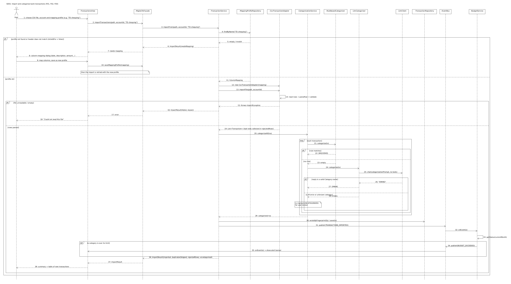

UMLet source: [diagrams/uxf/sd01_import.uxf](diagrams/uxf/sd01_import.uxf)

### SD02: Correct a category / set a budget, with undo
Shows the Command pattern: the facade wraps the edit in a command, `CommandHistory` executes it and keeps it for undo/redo.

**SD02: Correct a category / set a budget, with undo (F02, F04)**

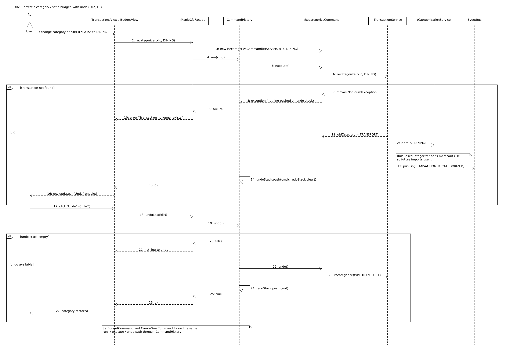

UMLet source: [diagrams/uxf/sd02_edit_undo.uxf](diagrams/uxf/sd02_edit_undo.uxf)

### SD03: Update an account and view net worth
Shows the Composite recursion: the root `AccountGroup` adds up its groups, which add up their accounts.

**SD03: Update an account and view net worth (F03)**

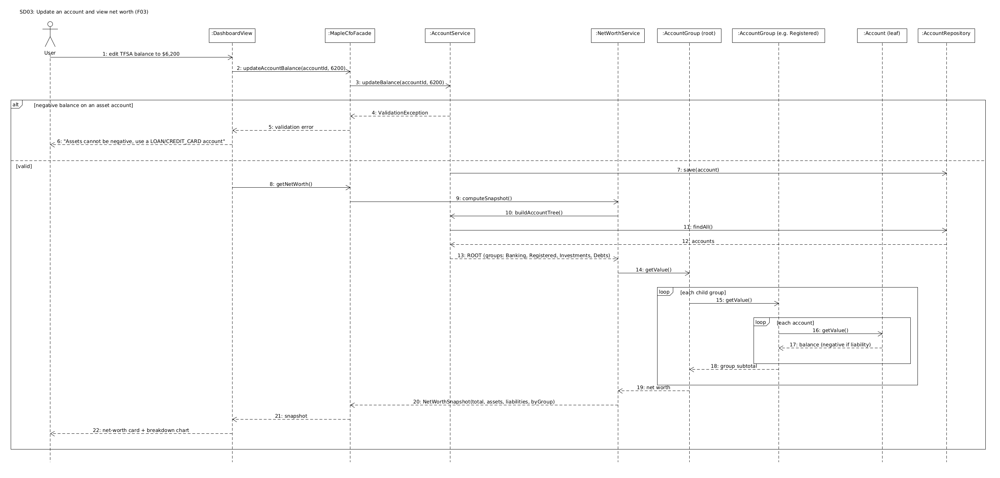

UMLet source: [diagrams/uxf/sd03_networth.uxf](diagrams/uxf/sd03_networth.uxf)

### SD04: Check TFSA / RRSP / FHSA contribution room
Deterministic rule computation with configuration-driven limits and an over-contribution warning event.

**SD04: Check TFSA / RRSP / FHSA contribution room (F06)**

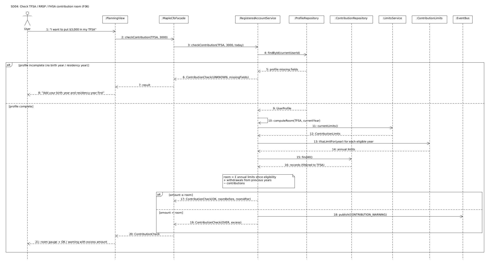

UMLet source: [diagrams/uxf/sd04_room.uxf](diagrams/uxf/sd04_room.uxf)

### SD05: FIRE projection and debt payoff plan
Two deterministic calculators. The debt planner uses the Strategy pattern, selected at run time.

**SD05: FIRE projection and debt payoff plan (F07, F08)**

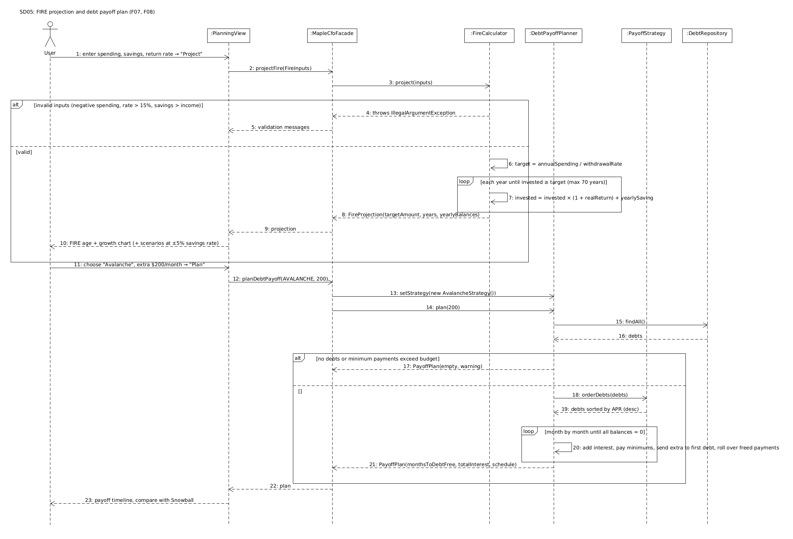

UMLet source: [diagrams/uxf/sd05_planning.uxf](diagrams/uxf/sd05_planning.uxf)

### SD06: Detect recurring charges
A read-only analysis built on the transaction history.

**SD06: Detect recurring charges and subscriptions (F05)**

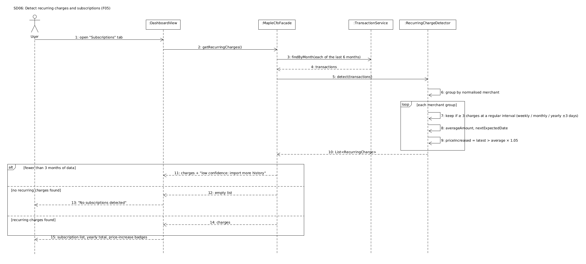

UMLet source: [diagrams/uxf/sd06_insights.uxf](diagrams/uxf/sd06_insights.uxf)

### SD07: Create and forecast a savings goal
Goal creation as an undoable command, followed by a forecast that uses the cash-flow forecaster.

**SD07: Create and forecast a savings goal (F09)**

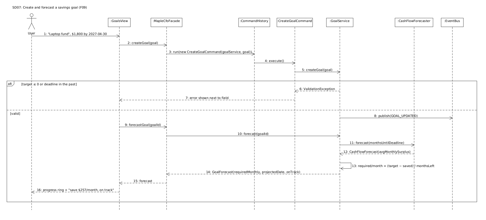

UMLet source: [diagrams/uxf/sd07_goal.uxf](diagrams/uxf/sd07_goal.uxf)

### SD08: Ask the AI CFO (multi-step agent loop)
The core agent behaviour: reason → call tools → observe → answer, with argument validation, recovery from LLM and tool errors, a step limit, and the grounding check.

**SD08: Ask the AI CFO, a multi-step tool-using agent loop (F10)**

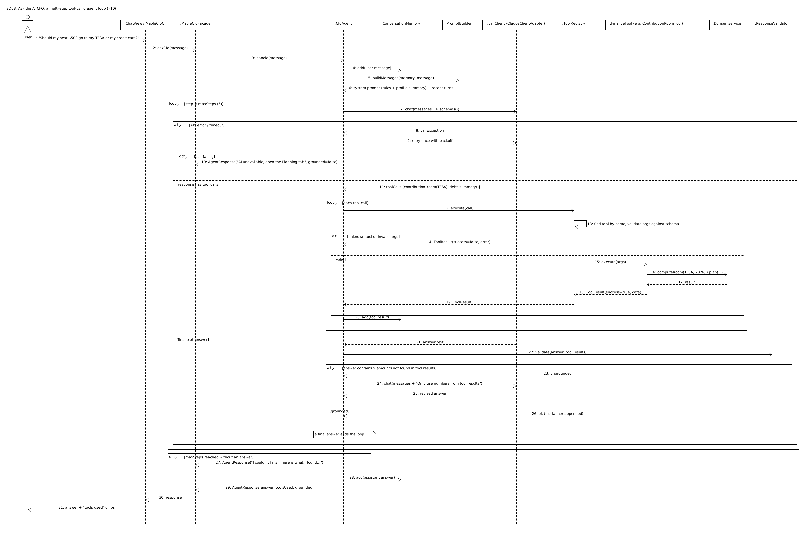

UMLet source: [diagrams/uxf/sd08_agent.uxf](diagrams/uxf/sd08_agent.uxf)

### SD09: "Can I afford it?" with a proposed action
Planning across several steps and tools (affordability → propose a goal), and the **human-in-the-loop** confirmation implemented with Command objects.

**SD09: "Can I afford it?", the agent proposes an action (F11, F10)**

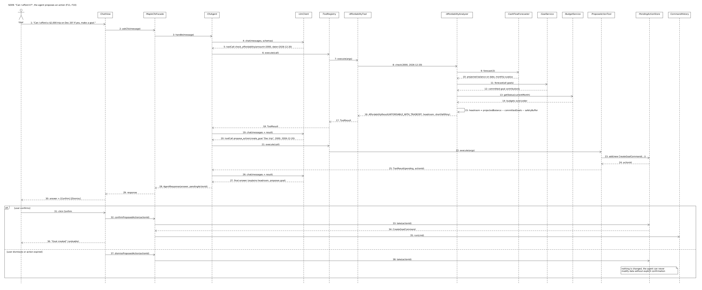

UMLet source: [diagrams/uxf/sd09_afford.uxf](diagrams/uxf/sd09_afford.uxf)

### SD10: Generate the monthly summary
The figures are deterministic, and the narrative comes from the LLM with a non-AI fallback.

**SD10: Generate the monthly summary (F12)**

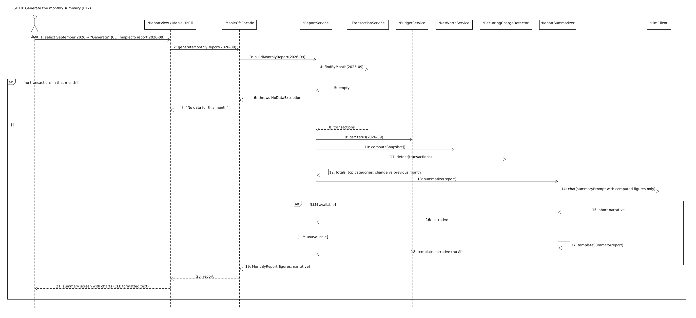

UMLet source: [diagrams/uxf/sd10_report.uxf](diagrams/uxf/sd10_report.uxf)

### SD11: Auto-sync, a CSV dropped in the watch folder
`ImportFolderWatcher` triggers the normal import, then two **Observers** react in parallel: `BalanceSyncService` updates balances, and `ContributionDetector` proposes a `RecordContributionCommand` that the user confirms.

**SD11: Auto-sync, a CSV dropped in the watch folder (F13, F14)**

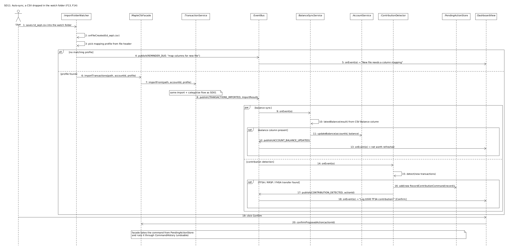

UMLet source: [diagrams/uxf/sd11_autosync.uxf](diagrams/uxf/sd11_autosync.uxf)

### SD12: App start-up, self-updating limits with fallback
`LimitsService` tries its **Strategy** providers in order, validates anything downloaded, and falls back to the cached and then the bundled limits, so room calculations never break.

**SD12: App start-up, self-updating contribution limits with fallback (F15)**

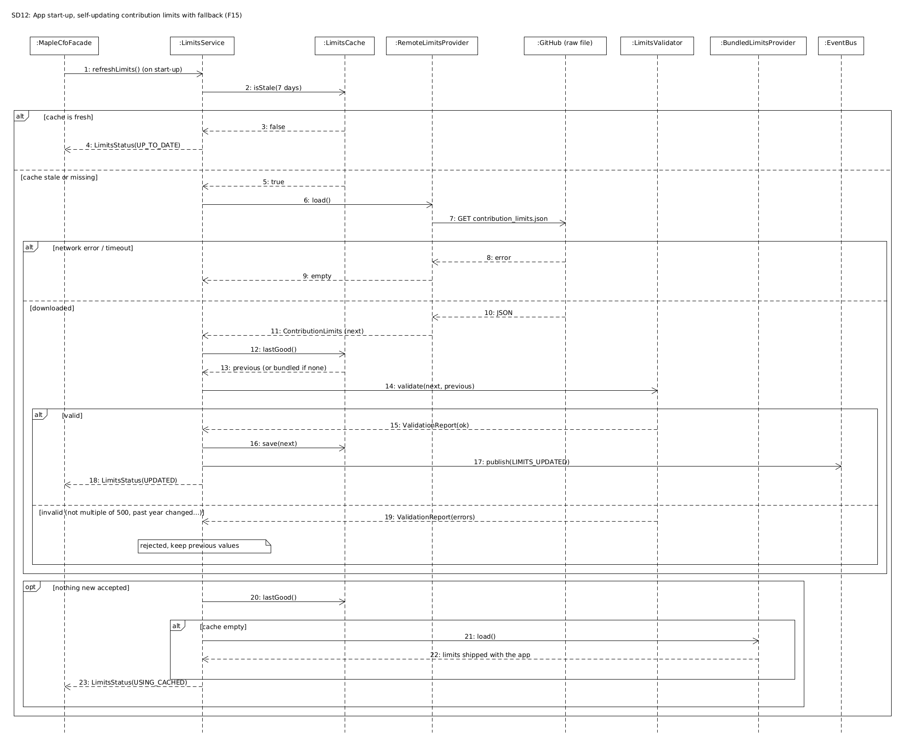

UMLet source: [diagrams/uxf/sd12_limits_refresh.uxf](diagrams/uxf/sd12_limits_refresh.uxf)

### SD13: Weekly limits bot with failure alerts
Runs outside the app in GitHub Actions. `CraLimitsScraper` (**Adapter** over CRA's web pages) feeds `LimitsValidator`; only valid changes are committed. Failures go to both `FailureNotifier`s: a GitHub issue and an email to the developer.

**SD13: Weekly limits bot with failure alerts (F15)**

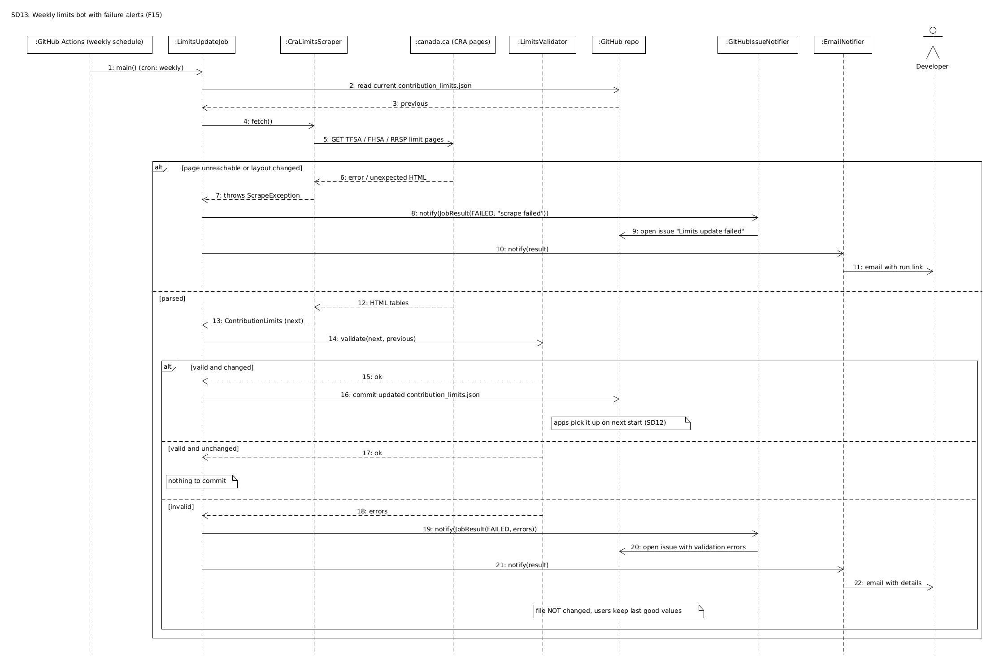

UMLet source: [diagrams/uxf/sd13_limits_bot.uxf](diagrams/uxf/sd13_limits_bot.uxf)

### SD14: RRSP room estimate
A deterministic estimate from last year's payroll deposits and the current RRSP rate and maximum, which the user confirms.

**SD14: RRSP room estimate from payroll deposits (F14)**

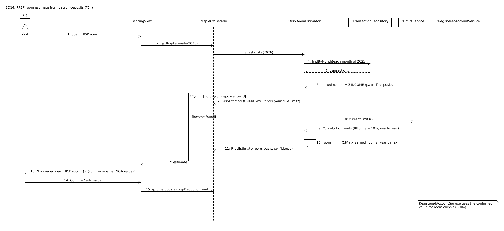

UMLet source: [diagrams/uxf/sd14_rrsp_estimate.uxf](diagrams/uxf/sd14_rrsp_estimate.uxf)

---

## 8. Feature-to-design traceability table

| Feature | Description | Type | Related use case | Classes | Key methods | Sequence diagram | Design pattern(s) |
|---|---|---|---|---|---|---|---|
| **F01** | Bank/card CSV import with mapping profiles | Deterministic | UC01 | TransactionsView, MapleCfoFacade, TransactionService, MappingProfileRepository, ColumnMapping, TransactionImporter, CsvTransactionAdapter, TransactionRepository | importTransactions(), saveMappingProfile(), importFrom(), findByName(), isValidFor(), importFile(), existsByFingerprint() | SD01 | Facade, Adapter, Repository |
| **F02** | Smart categorization with correction and undo | Hybrid | UC01, UC02 | CategorizationService, RuleBasedCategorizer, LlmCategorizer, LlmClient, PromptBuilder, RecategorizeCommand, CommandHistory, TransactionService | categorizeAll(), categorize(), learnFromCorrection(), recategorize(), run(), undo(), redo() | SD01, SD02 | Strategy, Adapter, Command |
| **F03** | Accounts and net-worth dashboard | Deterministic | UC03 | DashboardView, MapleCfoFacade, AccountService, NetWorthService, AssetComponent, AccountGroup, Account, AccountRepository | updateAccountBalance(), buildAccountTree(), computeSnapshot(), getValue() | SD03 | Composite, Facade, Repository |
| **F04** | Monthly budgets and alerts | Deterministic | UC04 | BudgetView, BudgetService, SetBudgetCommand, CommandHistory, EventBus, AlertService, FinanceEventListener | setBudget(), getStatus(), onEvent(), publish(), subscribe() | SD01, SD02 | Observer, Command |
| **F05** | Recurring charge detection | Deterministic | UC05 | DashboardView, MapleCfoFacade, TransactionService, RecurringChargeDetector | getRecurringCharges(), findByMonth(), detect() | SD06 | Facade |
| **F06** | TFSA / RRSP / FHSA room tracker | Deterministic | UC06 | PlanningView, RegisteredAccountService, ContributionLimits, ProfileRepository, ContributionRepository, EventBus | checkContribution(), computeRoom(), tfsaLimitFor(), loadFrom() | SD04 | Facade, Observer, Repository |
| **F07** | FIRE projection | Deterministic | UC07 | PlanningView, MapleCfoFacade, FireCalculator | projectFire(), project(), yearsToFire() | SD05 | Facade |
| **F08** | Debt payoff planner | Deterministic | UC08 | PlanningView, DebtPayoffPlanner, PayoffStrategy, AvalancheStrategy, SnowballStrategy, DebtRepository | planDebtPayoff(), setStrategy(), plan(), orderDebts() | SD05 | Strategy |
| **F09** | Savings goals and forecasts | Deterministic | UC09 | GoalsView, GoalService, CreateGoalCommand, CommandHistory, CashFlowForecaster | createGoal(), forecastGoal(), forecast(), recordDeposit() | SD07 | Command, Observer |
| **F10** | AI CFO chat (agent) | AI | UC10 | ChatView, MapleCfoCli, CfoAgent, ConversationMemory, PromptBuilder, LlmClient, ClaudeClientAdapter, ToolRegistry, FinanceTool, AbstractFinanceTool, ResponseValidator, PendingActionStore | askCfo(), handle(), buildMessages(), chat(), schemas(), execute(), doExecute(), validate() | SD08 | Adapter, Template Method, Factory Method, Command, Facade |
| **F11** | "Can I afford it?" | Hybrid | UC11 | GoalsView / ChatView, AffordabilityTool, AffordabilityAnalyzer, CashFlowForecaster, GoalService, BudgetService, ProposeActionTool, PendingActionStore, CommandHistory | checkAffordability(), check(), forecast(), confirmProposedAction(), take(), run() | SD09 | Command, Template Method, Facade |
| **F12** | Monthly summary with AI narrative | Hybrid | UC12 | ReportView, MapleCfoCli, ReportService, ReportSummarizer, LlmClient, BudgetService, NetWorthService, RecurringChargeDetector | generateMonthlyReport(), buildMonthlyReport(), summarize(), templateSummary() | SD10 | Facade, Adapter |
| **F13** | Auto-sync: watch folder, balances, reminders | Deterministic | UC13 | ImportFolderWatcher, TransactionService, BalanceSyncService, AccountService, DebtRepository, ReminderService, EventBus | startAutoImport(), onFileCreated(), importFrom(), onEvent(), updateBalance(), checkReminders() | SD11 | Observer, Facade, Adapter |
| **F14** | Smart contributions and RRSP estimate | Deterministic | UC14 | ContributionDetector, RecordContributionCommand, PendingActionStore, CommandHistory, RegisteredAccountService, RrspRoomEstimator | onEvent(), detect(), add(), confirmProposedAction(), run(), getRrspEstimate(), estimate() | SD11, SD14 | Observer, Command, Facade |
| **F15** | Self-updating limits + weekly bot | Deterministic | UC15 | LimitsService, LimitsProvider, RemoteLimitsProvider, BundledLimitsProvider, LimitsValidator, LimitsCache, LimitsUpdateJob, CraLimitsScraper, FailureNotifier, GitHubIssueNotifier, EmailNotifier | refreshLimits(), refreshIfStale(), load(), validate(), save(), run(), fetch(), notify() | SD12, SD13 | Strategy, Adapter |

---

## 9. Feature implementation explanations

### F01: Bank/card CSV import with column-mapping profiles
**Related use case:** UC01 · **Related sequence diagram:** SD01

**Classes involved**

- `TransactionsView`: collects the file, account and profile, shows the mapping dialog when needed, and shows the `ImportResult`.
- `MapleCfoFacade`: the single entry point, `importTransactions()` and `saveMappingProfile()`.
- `TransactionService`: coordinates profile lookup, import, categorisation, saving and events.
- `MappingProfileRepository` and `ColumnMapping`: saved column mappings, one per bank layout.
- `CsvTransactionAdapter`: adapts the CSV layout to `Transaction` objects (read, parse, validate).
- `TransactionRepository`: stores transactions and checks fingerprints.

**Important methods:** `TransactionsView.onImportClicked()`, `MapleCfoFacade.importTransactions()`, `TransactionService.importFrom()`, `MappingProfileRepository.findByName()`, `ColumnMapping.isValidFor()`, `CsvTransactionAdapter.importFile()`, `TransactionRepository.existsByFingerprint()`.

**Execution:** When the user clicks Import, the view calls `importTransactions()` on the facade, which delegates to `TransactionService.importFrom()`. The service loads the named `ColumnMapping` and checks it against the file's header with `isValidFor()`. If there is no profile, or it doesn't match, the view opens the mapping dialog and the new mapping is saved with `saveMappingProfile()`. The service then creates a `CsvTransactionAdapter` with the mapping and calls `importFile()`, which reads, parses and validates the rows. The resulting transactions are categorised (F02), duplicates are skipped using fingerprints, the rest are saved, and `TRANSACTIONS_IMPORTED` is published. The `ImportResult` goes back through the facade to the view.

### F02: Smart categorization with correction and undo
**Related use cases:** UC01, UC02 · **Related sequence diagrams:** SD01, SD02

**Classes involved**

- `CategorizationService`: runs an ordered list of strategies.
- `RuleBasedCategorizer`: merchant and keyword rules, including rules learned from corrections.
- `LlmCategorizer`: asks the LLM for a category name and rejects anything that is not a valid `Category`.
- `PromptBuilder`: builds the categorisation prompt.
- `LlmClient`: sends the request.
- `RecategorizeCommand`, `CommandHistory`: an undoable user correction.
- `TransactionService`: applies the change and publishes the event.

**Important methods:** `CategorizationService.categorizeAll()`, `CategorizationStrategy.categorize()`, `RuleBasedCategorizer.learnFromCorrection()`, `MapleCfoFacade.recategorize()`, `CommandHistory.run()` / `undo()` / `redo()`, `TransactionService.recategorize()`.

**Execution:** During import, `categorizeAll()` passes each transaction to `RuleBasedCategorizer` first. If no rule matches, `LlmCategorizer` builds a prompt and calls `LlmClient.chat()`, then `parseCategory()` accepts the reply only if it is exactly one of the `Category` names; otherwise the transaction is flagged for review. When the user corrects a row, the facade creates a `RecategorizeCommand` and gives it to `CommandHistory.run()`. The command calls `TransactionService.recategorize()` (which returns the old category, kept for undo) and `CategorizationService.learn()` adds a rule. Undo calls the command's `undo()`, which restores the old category.

### F03: Accounts and net-worth dashboard
**Related use case:** UC03 · **Related sequence diagram:** SD03

**Classes involved:** `DashboardView` (shows the net worth), `AccountService` (account CRUD, builds the Composite tree), `NetWorthService` (computes the snapshot), `AssetComponent` / `AccountGroup` / `Account` (Composite), `AccountRepository` (storage).

**Important methods:** `MapleCfoFacade.updateAccountBalance()`, `AccountService.buildAccountTree()`, `NetWorthService.computeSnapshot()`, `AssetComponent.getValue()`.

**Execution:** An edited balance is validated and saved by `AccountService`. `getNetWorth()` then calls `NetWorthService.computeSnapshot()`, which gets the root `AccountGroup` from `buildAccountTree()` and calls `getValue()`. Each group recursively adds up its children, and each account returns its balance (negative for liabilities). The snapshot, with the total and the per-group subtotals, is displayed and stored for the history chart.

### F04: Monthly budgets and overspending alerts
**Related use case:** UC04 · **Related sequence diagrams:** SD01 (alerts), SD02 (undoable set)

**Classes involved:** `BudgetView`, `SetBudgetCommand`, `CommandHistory`, `BudgetService` (status computation, and an observer of transaction events), `EventBus`, `AlertService` and the views (observers of `BUDGET_EXCEEDED`).

**Important methods:** `MapleCfoFacade.setBudget()`, `BudgetService.setBudget()` / `getStatus()` / `onEvent()`, `EventBus.subscribe()` / `publish()`.

**Execution:** Setting a limit creates a `SetBudgetCommand`, which saves the budget and remembers the previous one for undo. At start-up `BudgetService` subscribes to transaction events. When `TransactionService` publishes `TRANSACTIONS_IMPORTED` or `TRANSACTION_RECATEGORIZED`, `BudgetService.onEvent()` recomputes `getStatus()` for the month. For any category at or above its threshold it publishes `BUDGET_EXCEEDED`, which `AlertService` and `BudgetView` / `DashboardView` receive to show banners, without `TransactionService` knowing about any of them.

### F05: Recurring charge detection
**Related use case:** UC05 · **Related sequence diagram:** SD06

**Classes involved:** `DashboardView`, `MapleCfoFacade`, `TransactionService` (history), `RecurringChargeDetector` (the algorithm).

**Important methods:** `MapleCfoFacade.getRecurringCharges()`, `TransactionService.findByMonth()`, `RecurringChargeDetector.detect()`.

**Execution:** The facade loads the last six months of transactions and passes them to `detect()`. The detector normalises merchant names, groups the transactions, keeps groups with at least three charges at a regular interval, computes the average amount and next expected date, and flags price increases above 5%. The `RecurringCharge` list is shown in the Subscriptions panel. It is also used by `CashFlowForecaster` (F09, F11) and by the monthly report (F12).

### F06: TFSA / RRSP / FHSA contribution-room tracker
**Related use case:** UC06 · **Related sequence diagram:** SD04

**Classes involved:** `PlanningView`, `RegisteredAccountService` (rules), `ContributionLimits` (yearly limits loaded from JSON), `ProfileRepository`, `ContributionRepository`, `EventBus`.

**Important methods:** `MapleCfoFacade.checkContribution()` / `getContributionRoom()`, `RegisteredAccountService.computeRoom()` / `checkContribution()` / `recordContribution()`, `ContributionLimits.loadFrom()` / `tfsaLimitFor()`.

**Execution:** `checkContribution()` loads the `UserProfile`. If it is incomplete, it returns `UNKNOWN` with the missing fields. Otherwise `computeRoom()` adds up the annual limits from `ContributionLimits` for every eligible year, adds withdrawals from previous years and subtracts contributions from `ContributionRepository`. The amount is compared with the room: `OK` returns the room before and after, while `OVER` returns the excess and publishes `CONTRIBUTION_WARNING`. Because the limits come from a file, updating them each year needs no code change.

### F07: FIRE projection
**Related use case:** UC07 · **Related sequence diagram:** SD05

**Classes involved:** `PlanningView`, `MapleCfoFacade`, `FireCalculator` (pure function).

**Important methods:** `MapleCfoFacade.projectFire()`, `FireCalculator.project()` / `yearsToFire()`.

**Execution:** The view builds a `FireInputs` record and calls `projectFire()`. `FireCalculator.project()` validates the ranges, computes the target (spending ÷ withdrawal rate) and simulates year by year until the balance reaches the target or 70 years pass. It repeats the simulation for the scenario savings rates and returns a `FireProjection`, which the view charts. The calculator has no dependencies, so it can be tested with exact expected values.

### F08: Debt payoff planner
**Related use case:** UC08 · **Related sequence diagram:** SD05

**Classes involved:** `PlanningView`, `MapleCfoFacade`, `DebtPayoffPlanner` (context), `PayoffStrategy` with `AvalancheStrategy` and `SnowballStrategy`, `DebtRepository`.

**Important methods:** `MapleCfoFacade.planDebtPayoff()`, `DebtPayoffPlanner.setStrategy()` / `plan()`, `PayoffStrategy.orderDebts()`.

**Execution:** The facade maps the chosen `PayoffMethod` to a strategy object and calls `setStrategy()`, then `plan(extra)`. The planner loads the debts, asks the strategy for the payoff order, and simulates month by month (interest, minimum payments, extra payment to the first debt in the order, and freed payments rolled into the next one). It returns a `PayoffPlan`. The view calls the planner a second time with the other strategy to show the comparison.

### F09: Savings goals with forecasts
**Related use case:** UC09 · **Related sequence diagram:** SD07

**Classes involved:** `GoalsView`, `MapleCfoFacade`, `CreateGoalCommand`, `CommandHistory`, `GoalService`, `CashFlowForecaster`, `EventBus`.

**Important methods:** `MapleCfoFacade.createGoal()` / `forecastGoal()`, `GoalService.createGoal()` / `forecast()` / `recordDeposit()`, `CashFlowForecaster.forecast()`.

**Execution:** Creating a goal runs a `CreateGoalCommand` through `CommandHistory`, so it is undoable. `GoalService` validates and saves the goal and publishes `GOAL_UPDATED`. `forecast()` asks `CashFlowForecaster` for the average monthly surplus, computes the monthly amount needed to hit the target by the deadline, and returns a `GoalForecast` (on track or not), which the view shows as a progress ring.

### F10: AI CFO chat (multi-step, tool-using agent with memory)
**Related use case:** UC10 · **Related sequence diagram:** SD08

**Classes involved**

- `ChatView` / `MapleCfoCli`: the interface.
- `MapleCfoFacade.askCfo()`: the entry point.
- `CfoAgent`: the agent loop.
- `ConversationMemory`: recent turns and tool results.
- `PromptBuilder`: system rules and profile summary.
- `LlmClient` (e.g. `ClaudeClientAdapter`, created by `LlmClientFactory`): the model call.
- `ToolRegistry`: finds tools, validates arguments, returns their schemas.
- `AbstractFinanceTool` and its 10 subclasses: wrap the deterministic services.
- `ResponseValidator`: checks the answer is grounded and adds a disclaimer.
- `PendingActionStore`: holds proposed commands.

**Important methods:** `CfoAgent.handle()` / `runLoop()`, `PromptBuilder.buildMessages()`, `LlmClient.chat()`, `ToolRegistry.schemas()` / `execute()`, `AbstractFinanceTool.execute()` / `doExecute()`, `ResponseValidator.validate()`, `ConversationMemory.add()`.

**Execution:** `handle()` stores the user message and builds the messages. In a loop of at most six steps, it calls `LlmClient.chat()` with the tool schemas. If the response contains tool calls, each one goes through `ToolRegistry.execute()`, which finds the tool and runs its template `execute()`. That validates the arguments, calls `doExecute()` (which calls a service such as `RegisteredAccountService.computeRoom()`) and wraps the outcome in a `ToolResult`, including errors, so the LLM can recover. The results are added to memory and the loop continues. When the LLM returns text, `ResponseValidator.validate()` checks that every dollar amount appears in this turn's tool results. If not, it requests one revision. It then appends an educational disclaimer. The `AgentResponse` is returned through the facade. The LLM never computes figures itself and can change data only by proposing a command (see F11).

### F11: "Can I afford it?" affordability check
**Related use cases:** UC11, UC10 · **Related sequence diagram:** SD09

**Classes involved:** `GoalsView` / `ChatView`, `AffordabilityTool`, `AffordabilityAnalyzer` (verdict), `CashFlowForecaster`, `GoalService`, `BudgetService`, `ProposeActionTool`, `PendingActionStore`, `CommandHistory`.

**Important methods:** `MapleCfoFacade.checkAffordability()` / `confirmProposedAction()`, `AffordabilityAnalyzer.check()`, `CashFlowForecaster.forecast()`, `PendingActionStore.add()` / `take()`, `CommandHistory.run()`.

**Execution:** From the form, the facade calls `AffordabilityAnalyzer.check()` directly. From chat, the LLM calls `check_affordability`, which `AffordabilityTool` passes to the same analyzer. The analyzer projects the balance up to the date, subtracts committed goal contributions and a safety buffer, and classifies the result. The LLM explains it and may call `propose_action`. `ProposeActionTool` then creates a `CreateGoalCommand` and stores it in `PendingActionStore`, returning an id. The view shows Confirm/Dismiss. Only `confirmProposedAction(id)` takes the command and runs it through `CommandHistory`, so it is user-approved and undoable.

### F12: Monthly summary with AI narrative
**Related use case:** UC12 · **Related sequence diagram:** SD10

**Classes involved:** `ReportView` / `MapleCfoCli`, `ReportService`, `TransactionService`, `BudgetService`, `NetWorthService`, `RecurringChargeDetector`, `ReportSummarizer`, `LlmClient`.

**Important methods:** `MapleCfoFacade.generateMonthlyReport()`, `ReportService.buildMonthlyReport()`, `ReportSummarizer.summarize()` / `templateSummary()`.

**Execution:** `buildMonthlyReport()` loads the month's transactions and collects the deterministic figures from the services. If the month has no data, it raises `NoDataException` and the view shows a message. `ReportSummarizer.summarize()` sends only these figures to the LLM to write a short narrative, and falls back to `templateSummary()` if the LLM fails. The `MonthlyReport` is returned through the facade and displayed with charts in the GUI, or as formatted text in the CLI.

### F13: Auto-sync (watch folder, balances, reminders)
**Related use case:** UC13 · **Related sequence diagram:** SD11

**Classes involved**

- `ImportFolderWatcher`: watches the chosen folder with Java's `WatchService` and starts imports.
- `TransactionService`: runs the normal import and categorisation flow (F01/F02).
- `BalanceSyncService`: an Observer of `TRANSACTIONS_IMPORTED` that updates account and debt balances.
- `ReminderService`: checks last-import dates and month changes, and raises reminder alerts.
- `EventBus` and the views: deliver `ACCOUNT_BALANCE_UPDATED` and `REMINDER_DUE` to the GUI and CLI.

**Important methods:** `MapleCfoFacade.startAutoImport()`, `ImportFolderWatcher.onFileCreated()`, `TransactionService.importFrom()`, `BalanceSyncService.onEvent()`, `AccountService.updateBalance()`, `ReminderService.checkReminders()`.

**Execution:** `startAutoImport(folder)` starts the watcher. When a new CSV appears, `onFileCreated()` waits until the file size is stable, finds the mapping profile whose columns match the header, and calls `importTransactions()` on the facade, the same path as a manual import. After saving, `TransactionService` publishes `TRANSACTIONS_IMPORTED`. `BalanceSyncService` receives it, takes the balance from the newest row, and calls `AccountService.updateBalance()` (or updates the matching `Debt` for a card account), then publishes `ACCOUNT_BALANCE_UPDATED` so the dashboard refreshes. Separately, `ReminderService.checkReminders()` runs at start-up and daily, and publishes `REMINDER_DUE` for stale accounts or a new month.

### F14: Smart contributions and RRSP estimate
**Related use case:** UC14 · **Related sequence diagrams:** SD11, SD14

**Classes involved:** `ContributionDetector` (Observer plus rule matching), `RecordContributionCommand` (undoable Command), `PendingActionStore`, `CommandHistory`, `RegisteredAccountService` (receiver), `RrspRoomEstimator`, `LimitsService`.

**Important methods:** `ContributionDetector.onEvent()` / `detect()`, `PendingActionStore.add()`, `MapleCfoFacade.confirmProposedAction()`, `CommandHistory.run()`, `RegisteredAccountService.recordContribution()`, `MapleCfoFacade.getRrspEstimate()`, `RrspRoomEstimator.estimate()`.

**Execution:** On `TRANSACTIONS_IMPORTED`, `ContributionDetector.detect()` matches the new transactions against contribution rules. For each match it creates a `RecordContributionCommand`, stores it in `PendingActionStore`, and publishes `CONTRIBUTION_DETECTED` so the view shows Confirm/Dismiss. This is the same human-in-the-loop mechanism the AI agent uses. On Confirm, the facade runs the command through `CommandHistory`, which calls `RegisteredAccountService.recordContribution()`, and the command can be undone. For RRSP, `RrspRoomEstimator.estimate(year)` adds up last year's INCOME deposits, reads the RRSP rate and maximum from `LimitsService.currentLimits()`, and returns min(18% × income, max) as an `RrspEstimate` for the user to confirm.

### F15: Self-updating limits with weekly bot and alerts
**Related use case:** UC15 · **Related sequence diagrams:** SD12, SD13

**Classes involved**

- *In the app:* `LimitsService` (context), `LimitsProvider` with `RemoteLimitsProvider` and `BundledLimitsProvider` (strategies), `LimitsValidator`, `LimitsCache`.
- *Weekly job:* `LimitsUpdateJob`, `CraLimitsScraper` (adapter over CRA pages), the same `LimitsValidator`, and `FailureNotifier` with `GitHubIssueNotifier` and `EmailNotifier`.

**Important methods:** `MapleCfoFacade.refreshLimits()`, `LimitsService.refreshIfStale()` / `currentLimits()`, `LimitsProvider.load()`, `LimitsValidator.validate()`, `LimitsCache.save()` / `lastGood()`, `LimitsUpdateJob.run()`, `CraLimitsScraper.fetch()`, `FailureNotifier.notify()`.

**Execution:** At start-up, `refreshLimits()` calls `LimitsService.refreshIfStale()`. If the cache is older than 7 days, `RemoteLimitsProvider.load()` downloads `contribution_limits.json` from GitHub. `LimitsValidator.validate(next, previous)` checks that past years are unchanged, the TFSA limit is a multiple of $500, a new year is within ±$1,000 of the previous one, and the structure is correct. Valid data is saved to `LimitsCache` and `LIMITS_UPDATED` is published. Otherwise the service keeps `lastGood()`, or on a first run with no internet uses `BundledLimitsProvider`. Weekly, GitHub Actions runs `LimitsUpdateJob.run()`: `CraLimitsScraper.fetch()` reads CRA's pages, the same validator checks the result, and only valid changes are committed. Any scrape or validation failure leaves the file unchanged and calls every `FailureNotifier`, which opens a GitHub issue and emails the developer.

---

## 10. Important design decisions

| # | Decision | Rationale | Alternative rejected |
|---|---|---|---|
| D1 | **The LLM never does arithmetic.** Every number comes from deterministic services, exposed as tools. | Financial answers must be correct and reproducible. Deterministic code can be unit-tested (Stage 3, Part A). The LLM's role is planning and explanation (Part B). | Letting the LLM compute answers from raw transactions: cheaper to build, but it produces hallucinated or incorrect numbers. |
| D2 | **`ResponseValidator` grounding guard.** Dollar amounts in the final answer must appear in this turn's tool results. | A deterministic safeguard against hallucinated figures, which is also a clear behavioural requirement to test with KUMA. | Trusting the prompt alone. |
| D3 | **Human-in-the-loop for any data change.** The agent can only *propose* `UndoableCommand`s; the user confirms them. | Safety and trust: the AI can never silently change budgets or goals, and every confirmed action is undoable. | Letting the agent write directly through tools. |
| D4 | **GUI and CLI share `MapleCfoFacade`.** | Meets the GUI + CLI requirement without duplicating logic, and guarantees identical behaviour in both. | Separate controllers per UI. |
| D5 | **Local-first data: CSV import + SQLite, no live bank connection.** | Reliable, free, private, and easy to demo and test. Bank-aggregation APIs are paid, complex and region-limited. | Plaid or open-banking APIs. |
| D6 | **LLM behind an interface (`LlmClient` Adapter), with only two implementations: Claude and `MockLlmClient`.** | The agent code is independent of Claude's JSON format. The mock makes agent-loop tests deterministic and free, and lets the app run in demo mode without an API key. Another provider can be added later with one new class. | Calling the Claude API directly from `CfoAgent`, or supporting several providers from day one. |
| D7 | **Rules before AI for categorisation; the AI must answer with a valid category name.** | Cheaper, faster and predictable for common merchants. The LLM only handles the long tail, and invalid answers are flagged for review instead of guessed. | LLM-only categorisation. |
| D8 | **Contribution limits in a config file (`contribution_limits.json`).** | CRA limits change yearly. Data, not code, should change; the file itself updates automatically (D15). | Hard-coded constants. |
| D9 | **Bounded agent loop (max 6 steps) + one retry on LLM errors + schema validation of tool arguments.** | Prevents runaway loops and costs, and handles malformed LLM output safely. These behaviours will be targeted by KUMA tests (tool failures, invalid arguments, step limits). | An unbounded ReAct loop. |
| D10 | **Education-only scope.** The agent refuses specific investment or stock picks and adds a disclaimer. | Responsible AI in a financial domain. MapleCFO is not a licensed financial advisor. | Unrestricted advice. |
| D11 | **`Money` value object using `BigDecimal`.** | Avoids floating-point rounding errors in totals. | `double` amounts. |
| D12 | **Lean core scope: one generic CSV importer with saved mapping profiles and on-screen summaries (no file export).** | Keeps the project buildable and fully testable in the course timeline, while every required element (GUI, CLI, 10+ features, 5+ patterns, real agent behaviour) is met. | Separate adapters per bank, a card-rewards optimizer and PDF/CSV export (possible future extensions). |
| D13 | **Automate everything after the bank download (F13, F14).** A watch folder, balance sync, contribution detection and reminders. | After a one-time setup the user's only job is saving CSVs. Automations reuse existing patterns (Observer events, Command confirmation), so they add little coupling. | Manual import and manual balance and contribution entry. |
| D14 | **Detected contributions are proposals, not automatic writes.** | The same human-in-the-loop rule as the AI agent: nothing changes the user's records without Confirm, and everything is undoable. | Auto-recording every matching transfer, which risks false positives. |
| D15 | **Contribution limits come from a validated remote file, kept current by a weekly bot, with fallbacks and failure alerts (F15).** | No end-user typing and no developer typing errors. Scraping is fragile, so both the bot and the app validate with the same `LimitsValidator`, fall back to the last good values, and alert the developer by GitHub issue and email instead of saving bad data. | End users typing limits; the developer editing the file by hand; the app scraping CRA directly (fragile and slow). |

### 10.1 How the design prepares for Stage 3 testing

- **Deterministic components (JUnit 5):** `FireCalculator`, `DebtPayoffPlanner` + strategies, `RegisteredAccountService`, `RecurringChargeDetector`, `BudgetService`, `LimitsValidator` (every rule), `LimitsService` fallback order (with fake providers), `ContributionDetector` rules, `RrspRoomEstimator`, `BalanceSyncService`, `ReminderService` (with a fixed `Clock`), `ImportFolderWatcher` (temporary folder), `AffordabilityAnalyzer`, `CsvTransactionAdapter` + `ColumnMapping`, `CommandHistory`, `EventBus`, `ToolRegistry` argument validation, `ResponseValidator`. Integration tests go through `MapleCfoFacade` with in-memory repositories and `MockLlmClient`.
- **Agent behaviour (KUMA):** candidate behavioural requirements include correct tool selection (e.g. contribution-room questions must call `contribution_room`), no invented figures (grounding), respecting user constraints ("under $300"), never changing data without confirmation, recovering from tool errors, refusing out-of-scope investment picks, and asking for clarification on ambiguous requests.

### 10.2 Technology stack (planned)

| Concern | Choice |
|---|---|
| Language | Java 21 (Maven build) |
| GUI | JavaFX 21 |
| CLI | picocli |
| Persistence | SQLite via JDBC (`sqlite-jdbc`) |
| JSON | Jackson |
| Folder watching | Java NIO `WatchService` |
| HTML parsing (limits bot) | jsoup |
| Automation / CI | GitHub Actions (weekly limits job; failure email through GitHub notifications and an SMTP action) |
| LLM | Anthropic Claude Messages API over `java.net.http.HttpClient`; `MockLlmClient` for tests and demo mode |
| Testing | JUnit 5, Mockito; KUMA for agent behaviour |
| Version control | Public GitHub repository (the same repository for all three stages) |

### 10.3 AI assistance disclosure (Stage 1)

This design was developed with the help of an AI assistant (Anthropic Claude) for brainstorming project ideas, drafting feature specifications and producing the UML diagrams as UMLet (`.uxf`) files. The author reviewed and refined the scope, features, class responsibilities and pattern choices. AI use during implementation will be documented in the Stage 2 collaboration log, as the course requires.
